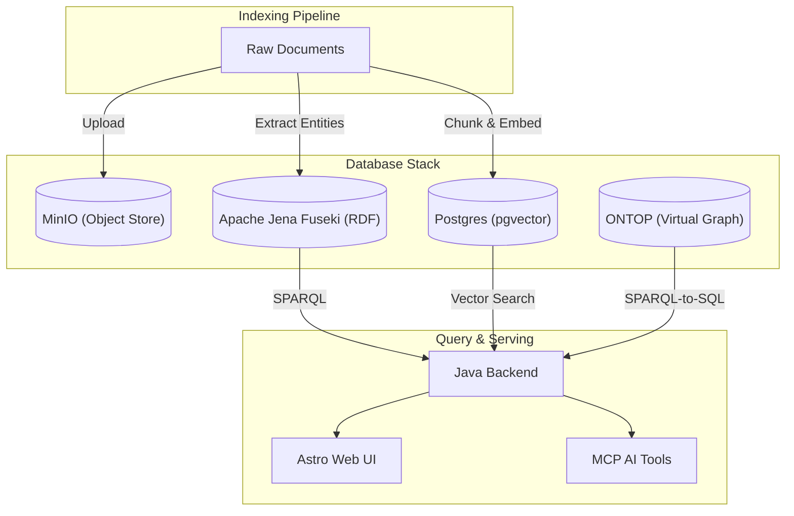

 

# Why a knowledge graph?

When you're trying to build an enterprise-scale "wiki" or memory system for an AI, the first question is how to store the data. I chose a knowledge graph. Why? Because linking many entities, names, and concepts together allows both humans and AI to traverse and discover related information naturally. 

If you just dump documents into a vector database, you get semantic search, that's all well and good but it lacks navigable links from one concepts to other concepts. A knowledge graph lets you explicitly state that "Person A is the CEO of Company B" and "Company B is headquartered in Region C". It builds a web of context that an AI can navigate.

# What is a Context Graph?

While a Knowledge Graph focuses on linking entities and concepts together to form a web of information, a **Context Graph** takes this a step further. The primary difference is that a Context Graph provides a strict audit trail, provenance, and data lineage on top of those semantic definitions. It doesn't just know *what* a relationship is; it knows *where* it came from, *who* asserted it, and *when*.

We can visualize this as the intersection of three distinct domains:

  <svg viewBox="0 0 500 500" width="100%" max-width="500px" xmlns="http://www.w3.org/2000/svg" style="font-family: sans-serif;">
    <!-- Circles -->
    <circle cx="175" cy="200" r="150" fill="rgba(3, 169, 244, 0.2)" stroke="#03a9f4" stroke-width="2"/>
    <circle cx="325" cy="200" r="150" fill="rgba(156, 39, 176, 0.2)" stroke="#9c27b0" stroke-width="2"/>
    <circle cx="250" cy="330" r="150" fill="rgba(255, 152, 0, 0.2)" stroke="#ff9800" stroke-width="2"/>

    <!-- Labels for Circles -->
    <text x="100" y="120" text-anchor="middle" font-weight="bold" fill="#0277bd">Ontology</text>
    <text x="100" y="140" text-anchor="middle" font-size="12" fill="#0277bd">(Semantics)</text>

    <text x="400" y="120" text-anchor="middle" font-weight="bold" fill="#7b1fa2">Provenance</text>
    <text x="400" y="140" text-anchor="middle" font-size="12" fill="#7b1fa2">(Auditability)</text>

    <text x="250" y="440" text-anchor="middle" font-weight="bold" fill="#e65100">Network Analysis</text>
    <text x="250" y="460" text-anchor="middle" font-size="12" fill="#e65100">(Linkage)</text>

    <!-- Intersections -->
    <!-- A + B (Top center) -->
    <text x="250" y="140" text-anchor="middle" font-size="12" font-weight="bold" fill="#333">Semantic</text>
    <text x="250" y="155" text-anchor="middle" font-size="12" font-weight="bold" fill="#333">Lineage</text>

    <!-- A + C (Bottom left) -->
    <text x="160" y="290" text-anchor="middle" font-size="12" font-weight="bold" fill="#333">Knowledge</text>
    <text x="160" y="305" text-anchor="middle" font-size="12" font-weight="bold" fill="#333">Graph</text>

    <!-- B + C (Bottom right) -->
    <text x="340" y="290" text-anchor="middle" font-size="12" font-weight="bold" fill="#333">Flow/Linkage</text>
    <text x="340" y="305" text-anchor="middle" font-size="12" font-weight="bold" fill="#333">Analysis</text>

    <!-- A + B + C (Center) -->
    <text x="250" y="235" text-anchor="middle" font-size="14" font-weight="bold" fill="#000">Context</text>
    <text x="250" y="255" text-anchor="middle" font-size="14" font-weight="bold" fill="#000">Graph</text>
  </svg>

- **Circle A (Ontology):** Semantic-oriented. Focuses on the meaning and definitions of concepts.
- **Circle B (Provenance):** Auditability and traceability-oriented. Focuses on the origin and history of data.
- **Circle C (Network & Link Analysis):** Linkage and traversal-oriented. Focuses on the connections between entities.

When these domains intersect, we get:
- **A + B (Semantic Lineage):** Understanding the history and origin of specific semantic definitions.
- **B + C (Flow/Lineage Analysis):** Tracing how data and relationships move or evolve across the network.
- **A + C (Knowledge Graph):** A semantic network of linked concepts (the traditional Knowledge Graph).
- **A + B + C (Context Graph):** The innermost intersection. A fully traceable, semantically rich, and deeply linked network of knowledge.

# Why RDF and not LPG?

This was a difficult choice. I am actually much more familiar with Labeled Property Graph (LPG) technology like Neo4j. LPG is an easier system to understand, the querying (like Cypher) feels more intuitive, and the concepts map really nicely to object-oriented programming. 

But ultimately, I went with RDF (Resource Description Framework). Why? Because of the richness of its ontology support, the ability to encode business rules directly into the ontology, and the foundational idea of linked data. 

One massive implication of RDF's ontology-driven development is that the ontology lives *outside* of the application code. This gives a beautiful separation of concerns: the application code just handles moving data around, while the business logic and schema live in the graph itself. 

I think some of the specific design decisions I make here could be applied to an LPG-styled graph, but it would require writing a lot more application-level code and ultimately expose a much larger maintenance surface.

## RDF vs. LPG Comparison

Here is how I break down the differences and why RDF won out for this specific use case:

| Feature               | RDF (Resource Description Framework)                          | LPG (Labeled Property Graph)                                                        |
| --------------------- | ------------------------------------------------------------- | ----------------------------------------------------------------------------------- |
| **Identity**          | Globally unique URIs (e.g., `http://my-wiki.com/entity/123`)  | Local, internal database IDs                                                        |
| **Ontology / Schema** | Formal (OWL/RDFS), shared, and decoupled from the application | Usually schema-on-read or database-specific constraints                             |
| **Reasoning**         | Built-in logical inference (forward/backward chaining)        | Relies on application code or graph algorithms                                      |
| **Query Language**    | SPARQL (W3C Standard)                                         | Cypher, Gremlin (Vendor-specific)                                                   |
| **Core Strengths**    | Data integration, provenance, stable identity, logical rules  | Deep traversal (shortest path), graph data science (PageRank), developer ergonomics |

# The Database Stack

To make this architecture work, we need a few different data stores playing nicely together:

- **Apache Jena Fuseki:** This is our core RDF triple store. It holds the graph, the ontology, and handles the reasoning.
- **Postgres (with pgvector):** Used for storing the raw document texts, the chunked text, and their vector embeddings.
- **MinIO:** An S3-compatible object store for keeping the original raw files (PDFs, text files).
- **ONTOP:** Used as a virtual knowledge graph layer to translate SPARQL queries into SQL for our structured relational data.

# The Indexing Pipeline

Getting unstructured data into the graph is handled by an indexing pipeline written in TypeScript. I use **Temporal** for workflow execution. Temporal is fantastic here because indexing involves slow, flaky steps (like OCRing a PDF or calling an LLM to extract entities). Temporal ensures that if a step fails, the workflow pauses and retries without losing state, and can cleanly roll back partial graph insertions if things completely break.

# Querying

Querying is handled by a Java backend that routes requests. It exposes endpoints for raw SPARQL, reasoned SPARQL (which applies inference rules), text search (via Lucene), and vector search (via Postgres). 

Ultimately, this is consumed by the AI via **MCP (Model Context Protocol)** tools or a CLI. This allows the LLM to query concepts or traverse entities from the graph without needing to know how to write perfect SPARQL. Because I have built MCPs elsewhere and because the querying is largely dependent on the choices made during indexing, I'll leave the deep implementation details of the MCPs as a future scope.

# Serving

We envision every entity or document being served as a web page, similar to a Wikipedia page. The relationships between entities are literally links from page to page. 

Crucially, this web page must be citable by external systems. Someone should be able to reference this piece of knowledge in a PDF report, a presentation, or send it as a web link in an email. This means the web page *must have stable URLs*. 

This requirement right away imposes a severe limitation: our knowledge graph must either grow continuously or keep track of entity identity over time. We cannot use a "nuke and rebuild" style where updates happen as a batch process and IDs don't survive between builds. This requirement plays a massive role in selecting RDF over LPG. In RDF, the URI is an inherent, foundational concept. In LPG, stable, globally resolvable identity is a matter of custom application-level code. 

I built this serving layer using **Astro** for server-side rendering, with **React Islands** for the interactive parts (like the graph visualization). It's great for spot checks and sanity checks. It provides trust and verifiable grounding for the LLMs.

# A System of Knowledge Record

Ultimately, what I have in mind is a **system of knowledge record**. Every entity or concept tracks:

- *Who* contributed it
- *When* it was recorded
- *Which document* it came from
- *What* other concepts are related to it, and *how*

When we feed this information to an LLM, we want it to be able to navigate this web of knowledge in place of us. We want it to make sense of the knowledge and use it as strict references when making decisions. 

The reference here is crucial because we want to guarantee **0% hallucination** from the LLMs. Meaning: every single assertion the AI makes must be backed up by sources in the graph, and we can explicitly quantify the agreement between the AI's assertion and the cited sources.