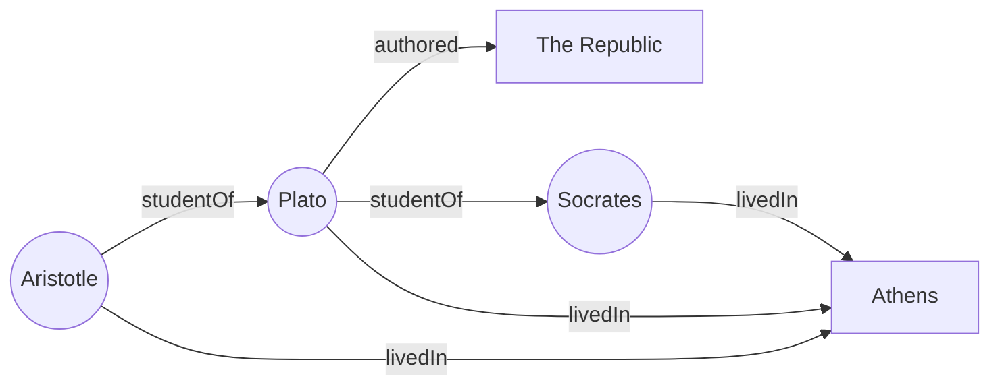

<br>

# what is RDF

RDF stands for resource description framework. It is a standard framework to describe linked data. Data is structured as a statement called "triple" composed of 3 parts: subject - predicate - object. A triple could be "Plato wrote the republic" or "Aristotle studied with Plato". Here we have graph with 3 nodes: Plato, the Republic, Aristotle and 2 relationships: Plato-authored-The Republic, and Aristotle-student of-Plato. Here "the Republic" nodes are two hops away from Aristotle, linked together by the node Plato. We can imagine that a large network of knowledge consists of millions of these triples linked together.

Here is a visual representation of how these simple triples connect to form a graph:



As you can see, by simply stating individual facts (triples) like `(Aristotle) -> [studentOf] -> (Plato)` and `(Plato) -> [authored] -> (The Republic)`, a connected web of knowledge naturally emerges.

# URI

But in RDF we don't simply say "Plato-authored-The Republic". RDF's most consequential design decision is to identify entity with URI or IRI (universal/internationalized resource identifier). If we simply refer to Plato in our RDF database as entity with person_id:42, this identity is "locally scoped", meaning it is only identifiable only within our database. A different database may have a different person with person_id:42 and that will not be our Plato. To refer to this entity outside of the database, we need a way to make sure that person_id:42 refers to our plato and not something else; we need a global scope.

Because RDF was conceived of in the context of semantic web, i.e. the global web of data, entity in rdf is globally scoped and inherits its uniqueness from the DNS system; that is to say, if you owns the website "[https://enterprise-wiki.com](https://enterprise-wiki.com)", then your Plato entity can be "[https://enterprise-wiki.com/entity/plato](https://enterprise-wiki.com/entity/plato)". Therefore, we have created the "global scope" identifier of the entity.

Note that using entity URI is consequential in many ways. 

First, we can create a page for entity simply by following the URI. A wikipedia entry for Plato will just be at "[https://enterprise-wiki.com/entity/plato](https://enterprise-wiki.com/entity/plato)". This is for human consumption. 

Second, URI can also be dereferenced in many ways. For example, we can do:

```bash
GET "https://enterprise-wiki.com/entity/plato.json"
```

Or:

```bash
curl -H "Accept: application/json" https://enterprise-wiki.com/entity/plato
```

This returns all triples associated with Plato, i.e. getting all of the links to and from this entity in JSON format. In the era of LLMs, we can also do:

```bash
GET "https://enterprise-wiki.com/entity/plato.md"
```

Or:

```bash
curl -H "Accept: text/markdown" https://enterprise-wiki.com/entity/plato
```

This returns markdown text optimized for LLM consumption.

In this way URI is not just a global name, but also a serving and retrieval mechanism. It allows entity to describe itself to us and to AI.

## The cost of maintaining URI

URIs are useful but they are costly. First URIs are more verbose than just id. This means it will consume LLM tokens. URI requires management (keeping track of the URI and make sure there is no collision). It will require mechanism for redirection, aliasing, and require maintaining dereferencing infrastructure. The ability to refer to entity in external system means the uri must be stable and maintained. this means the system of storage cannot be cleanly rebuild from blank slate every time. it must keep track of its history. This is why the labeled property graph like neo4j dominate the practice -- local ids are much easier to deal with. The power of URIs only comes in at scale and practice where the system integrate externally. Therefore, I think in the context of enterprise grade wiki, using URI makes sense.

# Ontology

Another unique and rich rdf feature is ontology. Saying that "Plato-authored-The Republic", for example in the context of property graph (Plato:Entity)-[AUTHORED]->(The Republic:Entity) seems sufficient. But RDF goes further by adding extra information. For example, if we look at AUTHORED, we can say the subject of this predicate must be a person and an object a creative work. We can also encode information such as isAuthoredBy as an inverse of Authored. 

Ontology information is important for ensuring the graph containing coherent and predictable information across many millions of triples. For example, if we know the domain and range of an object property, we can be sure which expression is valid and which is not.

# Open World vs Closed World Assumption

However, it is important to note the difference between the **Open World Assumption** (OWA) and the **Closed World Assumption** (CWA). Relational databases and many LPG implementations operate under a Closed World Assumption—if something is not explicitly stated, it is false, and if data violates the schema, it is rejected. 

RDF, by contrast, operates under an Open World Assumption. Even though we have an ontology that specifies the domain and range of an object property, we still consider our domain to be an open world. This means that if the LLM extracts extra information, information not found in the ontology, or even information that seems to disagree with the ontology, we admit that information into the graph instead of throwing it out. The absence of a fact does not mean it is false, and unexpected facts do not break the database. 

In the future, we can revisit this situation to evaluate how successful our extraction is, or how noisy the open world assumption makes the graph in practice. For now, admitting the data allows us to capture the messy reality of unstructured text without dropping potentially valuable context.

# Inference rules

An important consequence of having ontology is to be able to reason about it using logical inference. For example if we say 
`Plato-authored-the republic` and `Plato-authored-timaeus` and we define a logical rule:

```text
[sameAuthoredByRule: (?A ex:authored ?B), (?A ex:authored ?C) -> (?B ex:sameAuthoredBy ?C)]
```

With this we can derive a new fact that The Republic is samedAuthored By Timaeus.

Even though the example above may seem trivial, the ability to do logical inference is powerful. Here we will use this simple rule to do entity normalization. The rule is simple:

```text
[sameAsRule: (?A owl:sameAs ?B), (?B owl:sameAs ?C) -> (?A owl:sameAs ?C)]
[propertyTransferRule: (?A owl:sameAs ?B), (?A ?P ?O) -> (?B ?P ?O)]
```

We use the ontology `owl:sameAs` to denote this "symmetric and transitive" identity relationship. For example, when we perform entity extraction of an entity `Plato-123` from one source and an entity `Plato-456` from another source. we can perform entity normalization saying that `Plato-123 owl:sameAs Plato-456`. Upon denoting this, the inference rule can kicks in and materialize all of the properties belonging to `Plato-123` to also apply to `Plato-456` and vice versa.

# What we give up

Selecting RDF means making a real trade off in terms of what I think important or essential for enterprise knowledge wiki, and give up other properties as not as essential. For example, RDF can't really do deep traversal, like finding shortest paths between nodes, finding all paths between nodes, etc. In addition, we give up on many networking algorithms such as page rank, community detection. RDF does not any of these algorithms. To do page rank in RDF store means we will export the RDF triples as nodes and edges and compute it outside of the RDF store before writing the data back in. 

# Note on the philosophical and origin difference of RDF vs LPG

On reflection, I speculate on the philosophical difference between RDF and LPG as the differenfe in origin. RDF was born out of academic discipline thinking about linked data and web of data with formal linguistics. Knowledge representation in RDF maps closely to structure of logical proposition (subject-predicate-object). Thinking logical entailment and deriving new facts map nicely to what logicians are dealing with.

On the other hand, LPG comes from network science and object oriented programming (Neo4J where J means Java the major OOP language of early 2000s). Nodes map closely to object in object oriented programming paradigm. Relationships map to references between objects, and properties map to object field. Thinking and emphasizing traversal (BFS, DFS, shortest paths) seems to also be part of practical programming toolkits. This I think is also why LPG is more succesful with engineers -- it meets the engineers where they are, and why RDF ultimate vision of open web of data never really happened -- that RDF demands too much up front discipline and investment in ontology and formal logic from people who just want to ship software.

Another interesting observation that I have is that RDF seems to encourage documenting ontology ourside of the application code. Starting from ontology having URI, versioning, shared and open standard, or its separate life cycle, from the application code. This means the application does not own ontology, it merely references it. This is clear where the ontology is imported from domain specific open standard ontology set that are shared world wide. 

LPG on the other hand, has no specific open standard ontology or any encouragement to separate ontology from application. The practice is not standardized and vary from application to application. What we think of as "ontology" in LPG should properly be called "schema" as in the sense of SQL table "schema". That is to say, "schema" does not bear shared semantic meaning, schema largely bear structural concerns of that database, such as what property fields are allowed or what constraints are placed, concerning the shape of data. Schema seems to be fragmented across multiple layers of codes -- no schema at all, to database schema constraint only, to application level validation. 

The reason that LPG seems to be more popular on this is simply that ontology is difficult to do well. It's difficult to get off the ground in the first place, and also require specialize domain knowledge, tool systems to inspect and make ontology ergonomic, require thinking in terms of data modeling separate from application development, and require data governance practice. 
---
**Navigation:**
- Previous: [Part 2: System Architecture & Design]()
- Next: [Part 4: Data Indexing Pipeline]()
