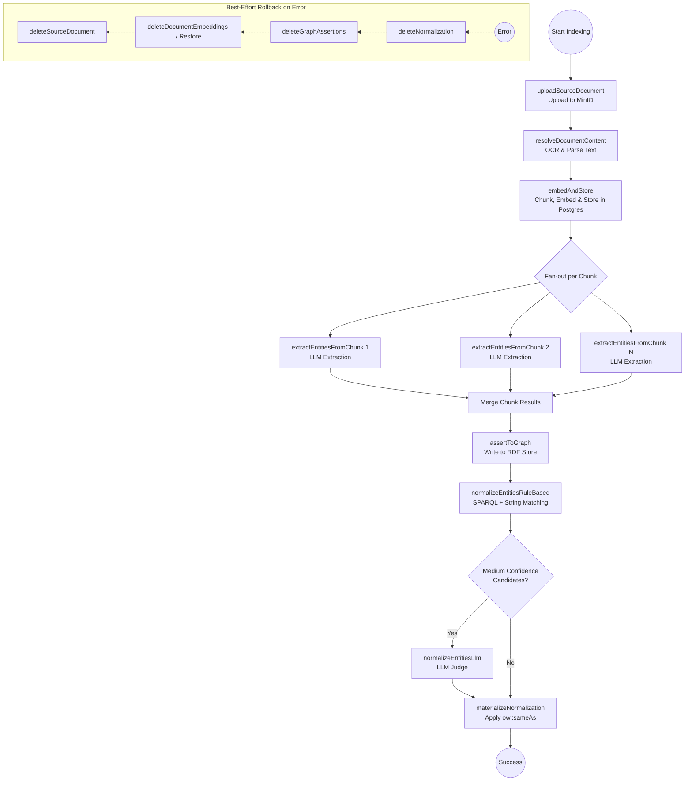

 

# The indexing pipeline

So far I've talked about why knowledge graphs, why RDF, and what the design looks like at a conceptual level. Now let's get into actually getting data into the thing. This is the indexing pipeline — the part that takes a raw document and turns it into triples living in the graph.

It's important to note that this indexing pipeline deals exclusively with **unstructured data** — things like PDFs, text files, and reports that require OCR and LLM extraction. It doesn't deal with structured data (like SQL databases or spreadsheets) at all. I'll cover how we handle structured data separately in Part 6.

The short version of the pipeline is: you give it a document, and it comes out the other end as a set of entities and relationships asserted into the RDF store, with full provenance attached. The long version involves a few interesting design decisions that I want to walk through.

Here is a flow diagram illustrating the Temporal indexing pipeline:

# Why Temporal

The first thing I want to explain is why I'm using Temporal as the workflow orchestration layer. Temporal is a workflow orchestration system that lets you write long-running, reliable workflows in code. The key property it gives you is durability — if a step fails halfway, the workflow can resume from where it left off rather than starting from scratch. This is important for an indexing pipeline because individual steps can be slow and expensive (OCR on a PDF, LLM extraction across 20 chunks), and you don't want to redo them if one step downstream fails.

The other thing Temporal gives you is compensation / rollback. If the pipeline fails after inserting data into the graph but before finishing normalization, you want to be able to clean up the partial state rather than leaving orphaned data behind. This is what saga pattern is about. I implemented a basic rollback — if something throws late in the pipeline, the workflow deletes what it wrote to the graph, restores the previous document embeddings from a snapshot, and removes the raw file from storage if it was newly created.

# Steps of the pipeline

The pipeline is a sequence of activities. I'll keep the first few brief so we can focus on the interesting parts:

**1. Upload source document**

We upload the raw file to MinIO (an S3-compatible object store) as the permanent record.

**2. Resolve content**

Once safely in storage, we extract the text. For plain text, we just read it. For PDFs, I use `liteparse` for OCR. The extracted text is saved back to MinIO as a separate object. This separation is crucial — you don't want to re-OCR a massive PDF every time a downstream step fails and retries.

**3. Chunk and embed**

We chunk the text (16k characters, 100-character overlap) and embed it using OpenAI's `text-embedding-3-small`. The embeddings are saved in Postgres using `pgvector`, alongside the raw chunk text and the document IRI. This enables semantic search later and lets us retrieve the exact source text for any fact.

**4. Extract entities and relationships**

For each chunk, we send a structured extraction request to GPT-4o. The LLM only sees the chunk text and the ontology — it knows nothing about the existing graph. It outputs JSON with two arrays: entities and relationships.

Because extraction happens *after* the document is uploaded, chunked, and safely stored, we get a beautiful provenance trail. We can refer to exactly which entity was extracted from which document, and even which specific chunk of that document. This is incredibly useful for provenance later when we need to trace a fact back to its exact source.

The ontology is fetched live from the graph at extraction time via SPARQL. If the ontology evolves, the extraction pipeline picks it up automatically without code changes.

**5. Assert to graph**

The merged extraction result gets posted to the Java backend's `/ingest/assertions` endpoint. The Java backend is responsible for everything that requires understanding RDF.

One key detail here is the **IRI minting strategy**. The backend doesn't just use random UUIDs. It uses a deterministic, hybrid slug-and-hash approach. It takes the entity's label, slugifies it, combines it with the dataset ID and entity type to create a seed, and generates a name-based UUID from that seed. It then takes the first 8 hex characters of that UUID to create a short hash. The final IRI path segment looks like `{datasetId}/{slug}-{shortHash}`. This makes the IRIs readable while preventing collisions, and ensures that the same label and type always yield the same IRI within a dataset.

The backend then builds the RDF-star SPARQL `INSERT DATA` statements with provenance annotations (document, extraction method, indexing run ID) and writes them to the asserted named graph.

**6. Normalize**

After assertions are written, the pipeline kicks off normalization. I'll describe this in depth in the next post since it has enough interesting stuff to deserve its own section. But the short version is: instead of some massive nightly batch job, we run normalization *per extraction step*. Meaning, every single time we extract entities from a document, we immediately try to normalize them against what's already in the graph, writing `owl:sameAs` links when we find matches.

# The rollback story

One thing I'm fairly happy with in this implementation is the rollback. If anything fails in the pipeline, the compensation logic unwinds what was written, in reverse order. Normalization gets deleted (by indexing run ID from the RDF-star annotation). Graph assertions get deleted. Postgres embeddings get restored from the snapshot that was captured before the upsert (if it's a re-indexing of an existing document). The raw file in MinIO gets deleted if it was newly created.

This matters for the continuous graph lifecycle principle — I don't want partial indexing runs to leave garbage in the graph. The rollback tries to be a clean undo of what was done.

The snapshot approach for document restoration is worth explaining. When a document is re-indexed (e.g., the document was updated or re-ingested), the pipeline loads the previous state of the document and its chunks from Postgres and saves that snapshot to MinIO before doing the upsert. If the pipeline fails later, the restore activity writes the snapshot back to Postgres. This way re-indexing is idempotent and recoverable.

# What I think about this

Here is a quick summary of the design decisions I made for the indexing pipeline and how I assess them now:

| Decision / Role   | Choice made      | Assessment                                                                                                                                              |
| ----------------- | ---------------- | ------------------------------------------------------------------------------------------------------------------------------------------------------- |
| **Orchestration** | Temporal         | Amazing. Saved me from writing my own saga logic and retry loops. Lets me write the pipeline as a simple sequential function.                           |
| **Extraction**    | GPT-4o per chunk | Works well for obvious entities, but misses cross-chunk relationships. Quality depends heavily on the ontology.                                         |
| **Chunking**      | 16k characters   | Fits the context window nicely, but it's a bit arbitrary. Might need a document-level first pass in the future.                                         |
| **OCR**           | `liteparse`      | Good enough for standard reports, but struggles with complex tables. The separation of OCR from the rest of the pipeline was definitely the right call. |

---
**Navigation:**
- Previous: [Part 3: Introduction to ontology, RDF]()
- Next: [Part 5: Data Normalization]()
