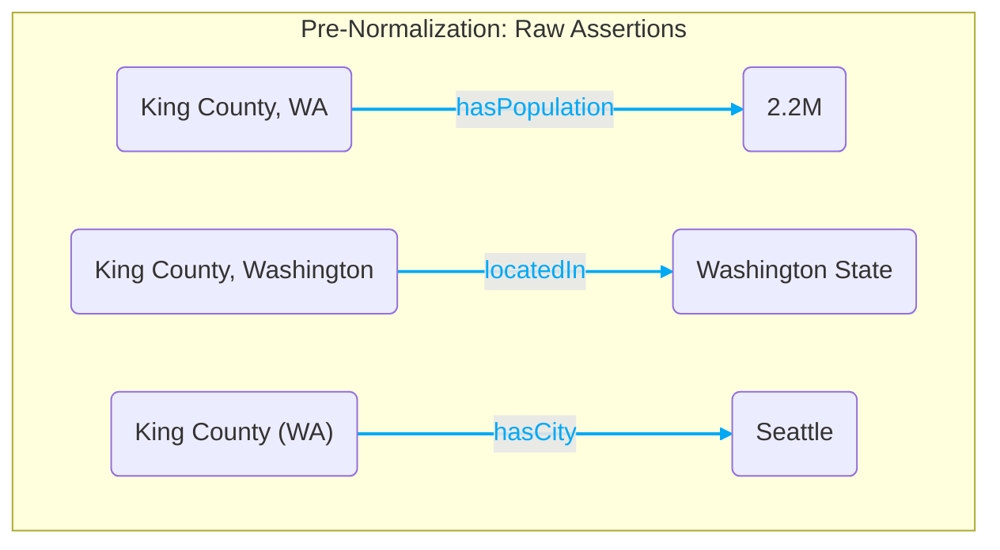
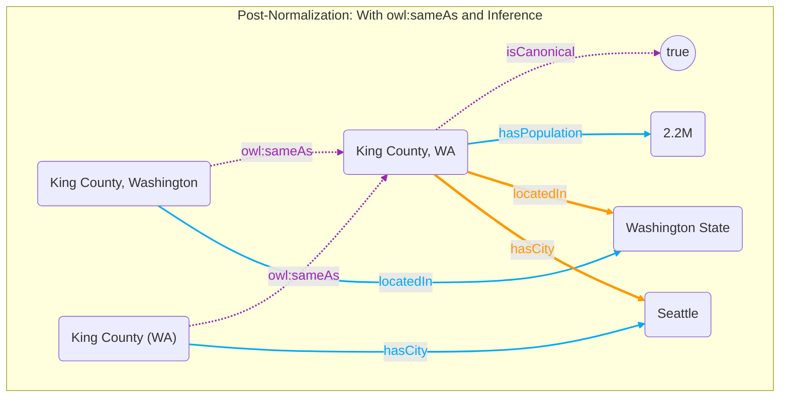

<br>

# The entity identity problem

Here's a scenario: you index a report that mentions "King County, WA". You then index another report that mentions "King County, Washington" and another that says "King County (WA)". Now you have three entities in the graph with different labels, all referring to the exact same place. An LLM querying the graph might traverse all three as if they were different places, or miss relationships attached to the other variants. This is the entity identity problem and it is one of the hardest parts of building a knowledge graph from unstructured data.

The naive solution is to just hard-merge them: pick one canonical label, point everything at it, delete the variants. This works until you have to undo it — which will happen. What if one of those variants was wrong? What if the merge was based on a bad heuristic? Now you've destroyed information. You have no record of what was merged, why, or with what confidence.

The approach I took instead is non-destructive normalization via owl:sameAs.

Here is a visual representation of what the graph looks like before and after normalization. 

**Legend:** 
- <span style="color:#03a9f4; font-weight:bold;">Blue edges</span>: `abox:asserted` (Raw extractions)
- <span style="color:#9c27b0; font-weight:bold;">Purple edges</span>: `normalization` (Identity links)
- <span style="color:#ff9800; font-weight:bold;">Orange edges</span>: `abox:inferred` (Materialized facts)





# owl:sameAs and why it helps

owl:sameAs is an OWL construct that says two URIs refer to the same real-world thing. If I assert that `entity:king-county-wa-1` owl:sameAs `entity:king-county-canonical`, and I'm running inference rules, then any query against the canonical entity automatically includes triples asserted against the variant, and vice versa. The reasoner closes over this symmetrically and transitively.

What this means in practice is that normalization is a set of curated decisions stored in a separate named graph (`urn:{dataset}:normalization`), not a destructive operation on the data. The variant entities still exist. Their original triples still exist. The normalization graph is an overlay that tells the reasoner how to treat them as equivalent.

This is a critical distinction from the inferred graph. The inferred graph is the output of forward chaining — it can be wiped and regenerated any time. The normalization graph contains intentional human (or LLM-mediated) decisions with provenance attached. It can never be automatically rebuilt from the raw data — it captures judgment calls about entity identity.

# The two-tier normalization strategy

For every new entity that comes in from an indexing run, the system tries to figure out if this entity already exists in the graph. I do this in two steps, running one after the other.

**Tier 1: Rule-based (Jaro-Winkler + Lucene)**

First, we use Jena-text (Lucene) to find fuzzy text matches. Then we compute Jaro-Winkler similarity. Scores ≥ 0.92 get an immediate `owl:sameAs` link. Scores between 0.75 and 0.92 get flagged for the LLM. We also do an intra-batch dedup for entities extracted in the same run.


**Tier 2: LLM-as-judge**

For the ambiguous middle zone, we send batches to GPT-4o. It looks at the labels, types, and descriptions, and returns a verdict. If it's highly confident (≥ 0.80), we write an `owl:sameAs` link. If it fails or is unsure, we just skip it — better to have unmerged entities than a crashed pipeline.


# Canonical election

Once sameAs pairs are written, the system needs to decide which entity in the cluster is the canonical one — the one that everything should be navigated through in the UI and queried against by the AI.

The election rule is simple: the entity with the highest in-degree in the sameAs graph (i.e., the one most frequently pointed to as the object of owl:sameAs assertions) is canonical. Ties are broken lexicographically by IRI. The winner gets an `ex:isCanonical true` marker written to the normalization graph.

This election runs incrementally — only clusters that contain at least one entity from the current indexing run are re-evaluated. This keeps it fast even as the graph grows.

# How it all flows through the reasoner and named graphs

To understand how this actually works in practice, you need to understand how the data lives in different named graphs. We don't just dump everything into one big bucket. We segment the data:


| Named Graph                     | What it contains                                         | Why we keep it separate                                                                                                                                                                             |
| ------------------------------- | -------------------------------------------------------- | --------------------------------------------------------------------------------------------------------------------------------------------------------------------------------------------------- |
| `urn:{datasetId}:abox:asserted` | Raw, extracted assertions from the LLM.                  | The ground truth of what was found in the documents. We never modify this unless we are rolling back an indexing run.                                                                               |
| `urn:{datasetId}:normalization` | `owl:sameAs` links and `ex:isCanonical` markers.         | The curated overlay of identity decisions. Keeping this separate means we can track exactly which entity is canonical, and we can audit or delete a bad merge without touching the raw extractions. |
| `urn:{datasetId}:abox:inferred` | New facts materialized by the forward-chaining reasoner. | Derived data that can be completely wiped and regenerated at any time if our rules change.                                                                                                          |


This separation of concerns is why the `owl:sameAs` strategy works so well. Even though the AI queries the graph and sees all the merged properties as if they belong to one canonical entity, the underlying data is strictly partitioned. We always know which raw assertion came from which specific variant entity in which specific document, because the raw assertions live untouched in the `asserted` graph. The `normalization` graph just tells the reasoner how to weave them together.

When we run the forward chaining materialization (which happens at the end of the indexing pipeline), the Java backend reads from the asserted and normalization graphs, applies the `owl:sameAs` rules, and writes the derived triples into the inferred graph.


The forward-chaining reasoner picks up `owl:sameAs` symmetry, transitivity, and property propagation. So if you have these raw assertions and normalization links:

```
# Asserted Graph
entity:apple-inc-1   ex:headquarters  "Cupertino"
entity:apple-inc-2   ex:ceo           "Tim Cook"

# Normalization Graph
entity:apple-inc-1   owl:sameAs  entity:apple-canonical
entity:apple-inc-2   owl:sameAs  entity:apple-canonical
```

Then the reasoner materializes the transitive links AND propagates the properties:

```
# Inferred Graph
entity:apple-canonical   owl:sameAs       entity:apple-inc-1
entity:apple-canonical   owl:sameAs       entity:apple-inc-2
entity:apple-inc-1       owl:sameAs       entity:apple-inc-2

entity:apple-canonical   ex:headquarters  "Cupertino"
entity:apple-canonical   ex:ceo           "Tim Cook"
entity:apple-inc-2       ex:headquarters  "Cupertino"
entity:apple-inc-1       ex:ceo           "Tim Cook"
```

...and importantly, any triple asserted against `entity:apple-inc-1` is also retrievable via a query against `entity:apple-canonical`. You don't have to think about which variant was used in which document. The reasoner makes them transparent across the named graphs.

# Provenance on normalization decisions

Every owl:sameAs triple in the normalization graph carries RDF-star annotations:

- `normalizationMethod`: "exact-label", "jaro-winkler", or "llm-judge"
- `confidence`: the score from the rule-based or LLM step
- `indexingRun`: the ID of the indexing run that produced this decision
- `transactionTime`: when the decision was made

This means if you want to audit why two entities were merged, you can query the normalization graph and see exactly what method produced the decision and when. And if an indexing run is rolled back, the rollback deletes exactly the sameAs triples introduced by that run, by filtering on the indexingRun annotation.

# What I think about this

Here is a quick summary of the design decisions I made for entity normalization and how I assess them now:


| Decision / Role              | Choice made                                               | Assessment                                                                                                                                                                                                                                                                                                                                                                                                                                                                                                                                                                                   |
| ---------------------------- | --------------------------------------------------------- | -------------------------------------------------------------------------------------------------------------------------------------------------------------------------------------------------------------------------------------------------------------------------------------------------------------------------------------------------------------------------------------------------------------------------------------------------------------------------------------------------------------------------------------------------------------------------------------------- |
| **Normalization Strategy**   | Non-destructive merge via `owl:sameAs`                    | Essential. Hard merges are a trap. Keeping variant entities intact while linking them allows the graph to evolve without ever needing a "nuke and rebuild". A nuke-and-rebuild strategy would destroy the stable identity of entities over time, making it impossible to reliably cite them in external systems (a foundational requirement we discussed in Part 1). This strategy solves multiple problems at once: provenance (which assertion came from which entity), trackability (if we delete a document, we know exactly which assertions to delete), and stable identity over time. |
| **Named Graph Architecture** | Separate graphs for Asserted, Normalization, and Inferred | Very important. It keeps the ground truth isolated, makes the identity decisions auditable and reversible, and lets us easily wipe and regenerate inferences.                                                                                                                                                                                                                                                                                                                                                                                                                                |
| **Tier 1 (Rule-based)**      | Jaro-Winkler + Lucene                                     | Fast and cheap. Handles the obvious duplicates perfectly.                                                                                                                                                                                                                                                                                                                                                                                                                                                                                                                                    |
| **Tier 2 (LLM-as-judge)**    | GPT-4o on ambiguous pairs                                 | Works well to keep costs down while resolving tricky cases. Thresholds (0.92 and 0.75) are empirically chosen and might need tuning for production.                                                                                                                                                                                                                                                                                                                                                                                                                                          |
| **Deduplication Scope**      | Per-document (incremental)                                | Efficient for continuous indexing, but misses cross-document duplicates that weren't caught in the same run. In the future, we need to add a global sweep step for deduplication.                                                                                                                                                                                                                                                                                                                                                                                                            |


---
**Navigation:**
- Previous: [Part 4: Data Indexing Pipeline]()
- Next: [Part 6: Dealing with Structured Data]()
