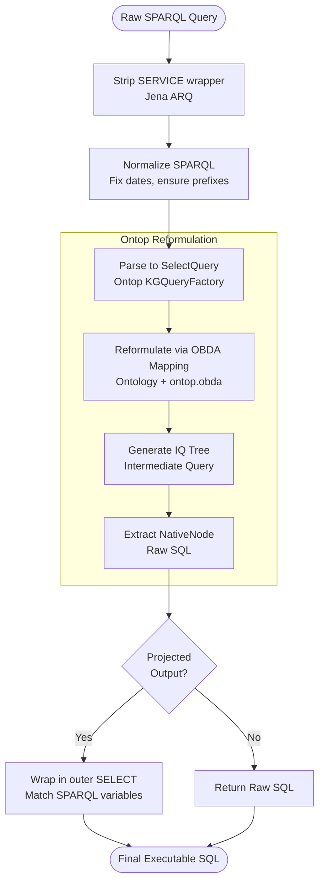

<br>

# The structured data problem

Most enterprise knowledge management systems have to deal with two kinds of data: unstructured documents (reports, articles, PDFs, emails) and structured relational data (databases, spreadsheets, data warehouses). The previous posts dealt with unstructured data — that's the indexing pipeline, entity extraction, normalization. But structured data is a completely different animal and it needs its own strategy.

For this proof of concept, I'm working with two sources of structured data: Google BigQuery (public datasets like the American Community Survey, Opportunity Atlas, and BLS QCEW) and a local Postgres database. The Postgres database holds a benchmarking insurance dataset (ACME P&C) that we use to bootstrap SPARQL-to-SQL translation. To do this translation, we use ONTOP, an open-source framework that we integrated into the Java backend as a dedicated endpoint.

The naive approach would be to lift all of this data into the RDF graph as triples. For the ACS dataset alone, you'd be talking about hundreds of millions of triples just to represent 200+ columns for 3,000+ counties across several years. This would immediately blow past any practical scale limit for a personal proof of concept. Even at enterprise scale, doing a full ETL copy of structured data into a triplestore is usually a bad idea — you're now running two stores of the same data, keeping them in sync, and paying twice for storage.

Here is a flow diagram showing how the SPARQL-to-SQL translation works under the hood using ONTOP:



# The semantic binding layer

The approach I took instead is what I call a semantic binding layer. The idea is simple: instead of copying the data into the graph, I annotate the RDF entities with enough metadata that an AI (or a translation engine like ONTOP) can figure out how to query the original relational data at query time.

In practice, this means we define mappings that tell the system how to translate graph concepts into SQL queries. For the insurance dataset, we use R2RML (RDB to RDF Mapping Language) bindings. This is the dataset we actually tested and proved out for SPARQL-to-SQL translation.

# What the binding actually looks like

The binding file for the insurance dataset maps the relational schema to the OWL ontology. For each table, it specifies the SQL query to pull the data, how to construct the subject IRI, and how to map columns to RDF predicates. It also includes example queries that the LLM can use as a reference.

Click to see the R2RML binding for the Insurance Policy table

```turtle
# ontology/insurance/bindings.ttl
# ------------------------------------------------------------
# 1. policy → in:Policy
# ------------------------------------------------------------

<#Policy>
    a rr:TriplesMap ;
    rdfs:label "Policy" ;
    rdfs:comment """Insurance policy records. Each row is one policy with an effective/expiration window
        and a unique policy_number. Join to policy_coverage_detail on policy_identifier to reach claims.
        Join to agreement_party_role on policy_identifier (= agreement_identifier) to reach agents and holders.""" ;

    rr:logicalTable [ rr:sqlQuery """
        SELECT policy_identifier, policy_number, effective_date, expiration_date,
               insurance_type_code, status_code
        FROM {schema}.policy
    """ ] ;

    rr:subjectMap [
        rr:template "{schema}/Policy-{policy_identifier}" ;
        rr:class in:Policy
    ] ;

    rr:predicateObjectMap [
        rr:predicate in:policyNumber ;
        rr:objectMap [ rr:column "policy_number" ; rr:datatype xsd:string ]
    ] ;
    rr:predicateObjectMap [
        rr:predicate in:policyEffectiveDate ;
        rr:objectMap [ rr:column "effective_date" ; rr:datatype xsd:dateTime ]
    ] ;

    ex:dataSource "{schema}" ;
    ex:joinKey    "policy_identifier" ;
    ex:queryExample
        ex:Policy_q01,
        ex:Policy_q02 .

ex:Policy_q01
    a ex:QueryExample ;
    rdfs:label "How many policies do we have?" ;
    ex:sql """SELECT COUNT(*) AS NoOfPolicy
FROM {schema}.policy""" .
```


# Why this is better than a full ETL

There are several reasons I strongly prefer this semantic binding approach over a massive ETL job:


| Aspect                     | Why Semantic Binding Wins                                                                                                                                                                                                                                                    |
| -------------------------- | ---------------------------------------------------------------------------------------------------------------------------------------------------------------------------------------------------------------------------------------------------------------------------- |
| **Currency**               | The RDF store doesn't lag behind. If the underlying Postgres or BigQuery data is refreshed, you automatically get fresh answers without re-indexing anything. A full ETL copy is stale the moment it finishes.                                                               |
| **No Triple Explosion**    | If we did a full ETL, we would get a massive amount of irrelevant, tiny triples (e.g., every single statistical observation for every county and year). This would be hard to deal with, increase noise, and drastically decrease the signal-to-noise ratio in our database. |
| **Scale**                  | Relational databases are built to handle analytical queries (aggregations, massive joins). Doing that at scale inside a SPARQL triplestore is painful. Let the SQL database do what it's good at.                                                                            |
| **Separation of Concerns** | The RDF graph owns the *semantic layer* (identity, relationships, provenance). The SQL database owns the *measurement layer* (raw numbers, time series). These are different concerns and different tools are better suited to each.                                         |


# What the query flow looks like

When an AI is querying the knowledge graph, the flow could be a back-and-forth combination of looking at the ontology or the binding layer, and then deciding how to pull the structured data. 

Because we have the SPARQL-to-SQL translation endpoint via ONTOP, the LLM has options. It could write a SPARQL query, send it to the translation endpoint, and get back the equivalent SQL. Instead of just blindly executing that SQL, the LLM can look at the translated SQL, review it against the schema context, and modify it to its liking if it needs tweaking. 

The goal here is that the ontology, the binding definitions, and the SPARQL-to-SQL translation all become part of the context for the LLM to decide how best to write the SQL. It could write in SPARQL, get the SQL translation, and execute that. Or, it could look at the translation, learn from the join patterns, and decide to write its own custom SQL from scratch. Both paths are totally valid and give the AI the flexibility to navigate the structured data accurately.

In practice, this means you can ask questions like "what's the median household income in counties where the public health literature mentions high diabetes prevalence?" The graph handles the semantic part — entity relationships, document provenance, what the literature says. The structured database handles the measurement part — actual census numbers. The AI stitches them together.

I should be honest that this is the most speculative part of the system. I built the binding layer and the translation endpoint, but the full query-time integration with an MCP tool is not completely done. It's more of a "phase 2" thing. But the architectural decision — don't copy structured data into the graph, use semantic binding instead — I think is the right one.

# The insight about different data granularities

One thing that struck me while building this is that different data sources operate at different granularities, and the graph is actually a natural place to handle that.

The Opportunity Atlas data is at census tract level (there are ~74,000 census tracts in the US). The ACS county data is at county level. BLS data is also at county level. The RDF graph can hold entities at all of these levels and relate them to each other (a census tract belongs to a county, a county belongs to a state). When the AI queries, it can choose the right granularity based on what the question requires — and the graph provides the traversal path to connect them.

This is an example of the semantic layer earning its keep: the relational databases treat each table independently, with FIPS codes as join keys. The graph explicitly models the containment relationships. "Show me all census tracts in King County" is a graph traversal. "Show me the income data for those tracts" is a SQL query against BigQuery using the fips codes of those tracts.

# What I think about this

Here is a quick summary of the design decisions I made for integrating structured data and my assessment of them:


| Decision / Role          | Choice made                              | Assessment                                                                                                                                                                                                                    |
| ------------------------ | ---------------------------------------- | ----------------------------------------------------------------------------------------------------------------------------------------------------------------------------------------------------------------------------- |
| **Data Integration**     | Semantic Binding Layer (R2RML / ONTOP)   | Excellent. It prevents the RDF store from lagging behind the source databases and completely avoids the "triple explosion" that would ruin our signal-to-noise ratio.                                                         |
| **Translation Engine**   | ONTOP (SPARQL-to-SQL)                    | Powerful, but complex. It works well for the ACME P&C insurance benchmark, but complex joins and aggregations involving multiple hop patterns can get tricky fast.                                                            |
| **Granularity Handling** | Graph for traversal, SQL for measurement | Very effective. The graph naturally models the containment relationships (e.g., tracts within counties), allowing the AI to traverse the graph to find the right FIPS codes, and then use SQL to pull the exact measurements. |


