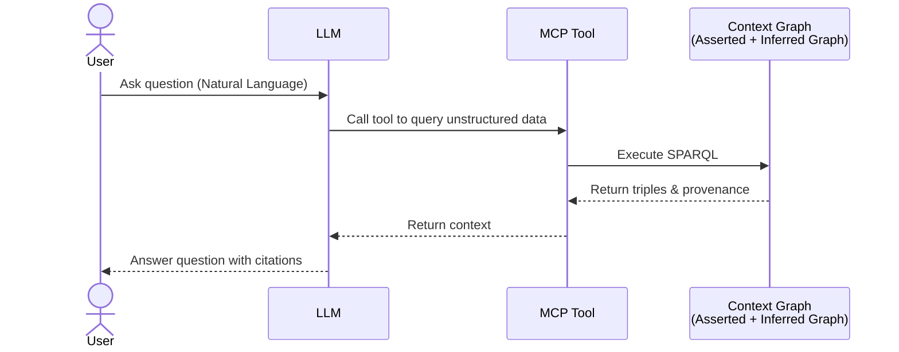
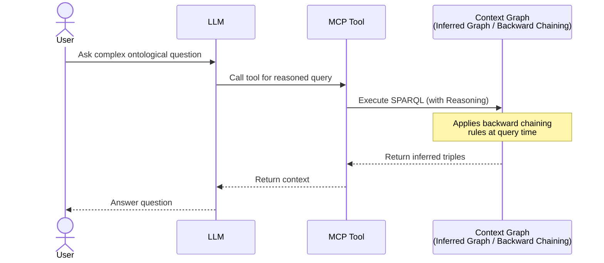
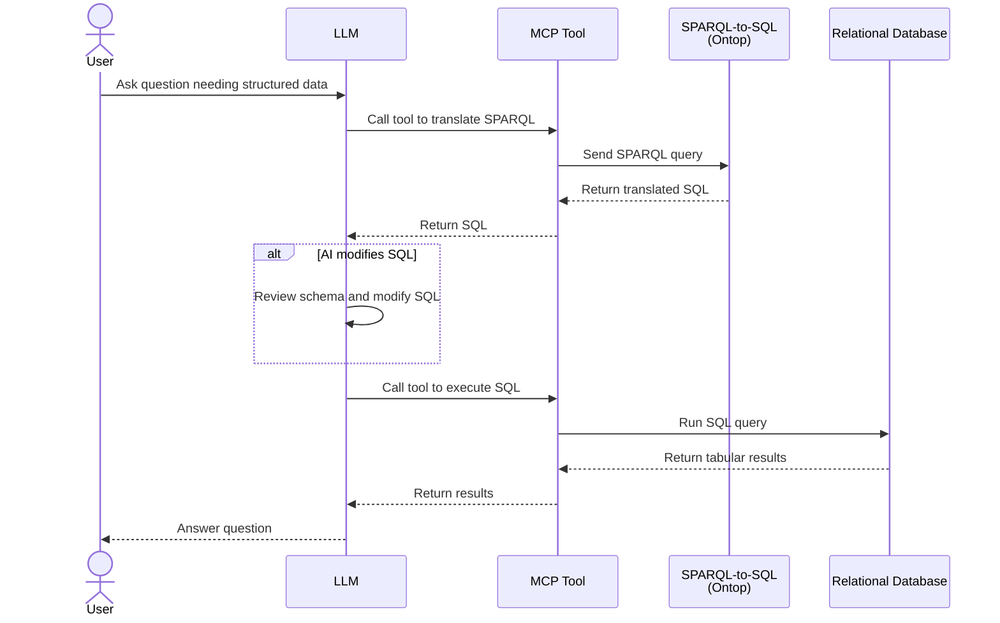
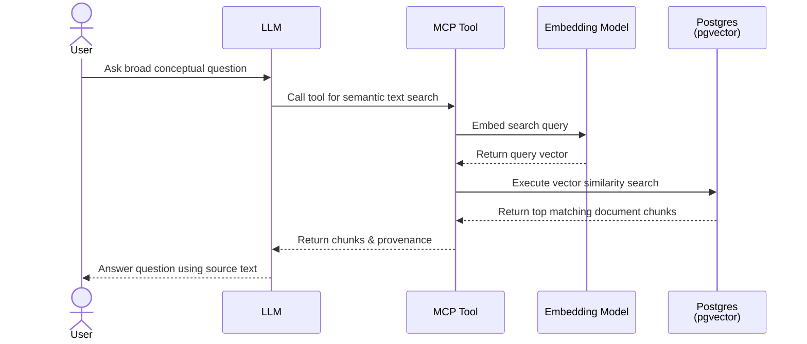

 

# How AI actually uses a knowledge graph

I've been talking a lot about building the graph — indexing documents, normalizing entities, building the ontology. But the whole point of building this thing is so that AI can use it. How does that actually work?

The primary interface for AI consumption is MCP — the Model Context Protocol, which is Anthropic's standard for giving LLMs access to tools. In this architecture, the MCP tools are thin wrappers around the Java backend's query endpoints. The LLM calls the tool, the tool hits the backend, the backend runs the query (with or without inference, depending on what's needed), and the results come back to the LLM as structured data.

Here are four sequence diagrams illustrating the different ways an AI can query the Context Graph depending on the type of information needed:

### 1. Querying Unstructured Information (Semantic Search)
When the user asks a question about facts extracted from documents, the AI uses the basic SPARQL endpoint to query the pre-materialized assertions.

### 2. Querying with Ontological Reasoning
When the user asks a complex or conceptual question that requires domain logic (like class inheritance or transitive relationships), the AI queries the inference endpoint.

### 3. Querying Structured Information
When the user asks for aggregations or measurements that live in a relational database, the AI uses the SPARQL-to-SQL translation layer (Ontop) to bridge the semantic gap.

### 4. Querying Vector Documents Directly
When the user asks a broad question that requires searching through raw document text rather than extracted entities, the AI performs a semantic vector search directly against the document embeddings stored in Postgres.

# The query routing architecture

The Java backend exposes a few query endpoints with different reasoning characteristics. I won't go into too much detail here, but the gist is that we have separate routes depending on what we need:

- A raw route for bypassing the reasoner entirely (useful for provenance lookups).
- A reasoned route that runs queries through the `InfModel` (which applies both forward-chained and backward-chained rules).
- A TBox route for querying the ontology itself.
- A text search route.

# Text and Vector Search

When the LLM needs to find an entity or a concept based on a user's natural language query, we actually have two distinct options:

1. **Text Search in RDF**: We can hit the Jena-text (Apache Lucene) index built over `rdfs:label` literals in the RDF store. This returns matching entity IRIs along with relevance scores. Because these IRIs might be variant (non-canonical) entities, we then do a second hop through the `InfModel` to resolve the canonical entity identity via the `owl:sameAs` closure.
2. **Vector Search in Postgres**: Because we stored the document chunks and their embeddings in Postgres (using `pgvector`) during the indexing pipeline, we can also perform a semantic vector search directly against the database.

Having both options means we can use exact/fuzzy keyword matching when we know the entity name, or semantic vector search when we are looking for broader concepts or paragraphs of text.

# owl:sameAs transparency

One of the nicest properties of this architecture is that owl:sameAs normalization is invisible to MCP tool consumers. The tool asks for an entity, and the reasoner automatically includes all properties from all co-referent variants. You don't have to know that the data was extracted across three different documents with three slightly different labels. From the tool's perspective, there's just one entity with a complete set of properties.

This is the payoff for all of the normalization work in part 5. Without it, the LLM would have to manually figure out that "King County, WA", "King County, Washington", and "King County (WA)" are the same thing, and manually aggregate their properties. With it, that's the reasoner's job.

# Reasoning as a query-time enrichment

Backward chaining rules make the knowledge graph more powerful than just a lookup table. A backward rule is essentially a derived predicate — a fact that can be derived from other facts at query time.

Here are a few patterns of query-time enrichment that we can do:

**1. Reflexive and Transitive Closure**
If we have a relationship like "A is a part of B" and "B is a part of C", we don't need to explicitly store "A is a part of C". We can write a backward chaining rule that infers this transitive relationship at query time. If the LLM asks "What is inside C?", the reasoner will automatically traverse the hierarchy and return A, B, and anything else inside them.

**2. Class and Subclass Inheritance**
If we define an ontology where `Pediatrician` is a subclass of `Doctor`, and `Doctor` is a subclass of `HealthcareProfessional`. If we extract an entity typed as `Pediatrician`, we don't need to explicitly assert that they are also a `HealthcareProfessional`. The reasoner handles this class inheritance dynamically. If the LLM queries for all `HealthcareProfessional`s in a region, the pediatrician will be returned.

**3. Property-based Classification**
In this system, I have rules for entity classification based on properties. An entity with a `fipsCode` property and certain other features can be classified as a `County` even if it wasn't explicitly typed as `County` in the extraction. The backward rule fires when the reasoner tries to evaluate `?entity a County` — it checks whether the evidence pattern matches, and if so returns true.

This means the graph doesn't need to explicitly store every derivable fact. The rules encode the domain logic. Adding a new rule changes what can be inferred without touching the stored data. This is the "ontology as business logic" principle from the design posts.

The reasoning playground I described in the visualization post was built specifically so I could test these rules in isolation — write a rule, write a SPARQL query, see what the reasoner derives. The playground runs the query against the base data and against the data augmented by the rules side-by-side, so you can see exactly what the rules contributed.

# The zero hallucination claim

In the first post, I mentioned "0% hallucination from LLMs, meaning every assertion must be backed up by sources." This is a strong claim and I want to be precise about what it means.

It means: for every factual assertion that the system returns to an LLM, there is a provenance trail — you can follow it to a specific source document, a specific chunk of text, and a specific extraction event with a confidence score and timestamp. The LLM can cite its sources because the graph requires sources for everything.

This is different from saying the extractions are always correct. An LLM can extract a wrong fact from a document and the system will faithfully store and return that wrong fact with high confidence. The system doesn't validate semantic correctness — it tracks origin. If the origin document is wrong or if the extraction was wrong, the provenance chain leads to the wrong source. You can then audit, retract, and correct.

The guarantee is not "everything in the graph is true". The guarantee is "everything in the graph was explicitly extracted from a named source, and you can look it up". That's a meaningful guarantee — it's the difference between a hallucinating AI and an AI that makes verifiable claims. Verifiable claims can be wrong and then corrected. Hallucinations can't be corrected because they have no ground truth to check against.

In the future, we could take this even further by assigning confidence scores or doing alignment scoring to ensure the extraction strictly aligns with the source text. And because the LLM uses assertions directly from the RDF store when answering questions, the final output aligns perfectly with the source material. This makes the entire pipeline a much nicer, more robust way to deal with the zero hallucination problem.

# Bridging to SQL with ONTOP

One direction I explored and successfully implemented is SPARQL-to-SQL query rewriting. The idea is that a query expressed in SPARQL against the ontology should be automatically translatable into an equivalent SQL query against the original relational database, using the R2RML binding layer as the translation map.

The benefit is that you get a single unified semantic query interface. An AI can write a SPARQL query using the ontology terms and get answers from either the RDF store or the SQL database transparently, depending on where the data lives.

This is currently done using ONTOP integration. Ontop is a tool that implements this kind of virtual knowledge graph — it takes SPARQL queries and rewrites them to SQL using R2RML mappings. I implemented this for the insurance benchmark dataset (a structured set of policy, claim, and customer tables), and it works beautifully. My benchmark showed that Ontop could handle many of the standard SPARQL patterns, though complex joins and aggregations involving multiple hop patterns can get tricky fast.

For the BigQuery datasets, I ended up going with the semantic binding approach I described in part 6 instead — giving the LLM enough context to write SQL directly. It's less formally elegant than SPARQL-to-SQL but more practical for the LLM-first world where the AI generates queries anyway. If the AI is already generating SQL, having a SPARQL translation layer in between doesn't add much.

In a traditional enterprise setting where you'd have existing SPARQL tooling and BI tools wanting to query through the ontology, the formal SPARQL-to-SQL approach via ONTOP is essential. For AI-native consumption, the semantic binding layer plus LLM-generated SQL is probably simpler, but having both options means we can adapt to whatever the use case demands.

# What I think about this

Here is a quick summary of the design decisions I made for AI query unification and my assessment of them:

| Decision / Role               | Choice made                             | Assessment                                                                                                                                                                                      |
| ----------------------------- | --------------------------------------- | ----------------------------------------------------------------------------------------------------------------------------------------------------------------------------------------------- |
| **Search Modality**           | Dual-track (RDF Text + Postgres Vector) | Excellent. Giving the LLM the ability to do exact/fuzzy keyword searches in the graph *or* semantic vector searches in the database covers all bases.                                           |
| **Query-time Enrichment**     | Backward Chaining Rules                 | Very powerful. It allows us to derive classifications, transitive closures, and class inheritance on the fly, keeping the triplestore clean and pushing domain logic into the ontology.         |
| **Zero Hallucination**        | Strict Provenance Tracking              | Essential. By tracking every assertion back to its source document and chunk, we turn hallucinations into auditable, correctable errors. Future alignment scoring will make this even stronger. |
| **SPARQL-to-SQL Translation** | ONTOP Integration                       | Great for traditional BI tools and formal semantic queries, though complex joins can be tricky. For AI-native workflows, the semantic binding layer (from Part 6) is often more practical.      |

---
**Navigation:**
- Previous: [Part 7: Data Visualization]()
- Next: [Part 9: Recap and Future Direction]()
