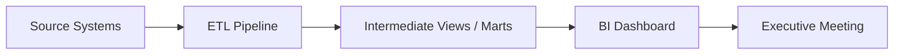
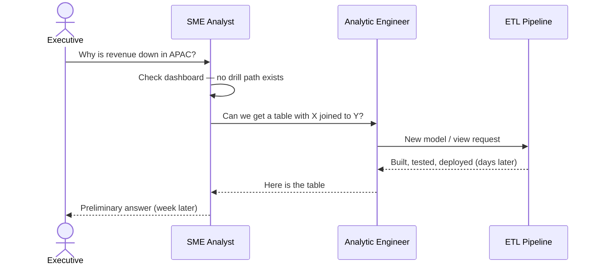

<br>

Most enterprise analytics still runs on a model built for a world where you know the questions before you know the answers. AI changes what becomes possible — but only if the architecture changes with it. This post lays out that shift in five parts, and the two ideas that connect them: semantic binding and the virtual knowledge graph.

For hands-on technical depth, see my [Enterprise Graph series]().

# 1. The Pre-AI Model

To see why a new paradigm matters, be precise about the model it replaces. The classic business intelligence stack follows a predictable shape:



The analytic engineer owns the ETL contract; the analyst owns the BI layer. Nobody is doing their job wrong. But the hidden assumption is that **the question must be known in advance**: revenue by region, churn by cohort are negotiated weeks earlier and encoded into pipelines and dashboard tiles. The dashboard is a preview of the conversation the organization expects to have.

That works until a new question comes up — revenue dips in a region that was supposed to grow, churn spikes in a cohort that looked healthy — and the executive asks the question the dashboard was never built to answer: **"Why?"** That single word kicks off a second, slower pipeline:



The back-and-forth is slow not because the people are slow, but because the architecture **front-loads all the agreement before the question is known**. I call this **ahead-of-time analytics**.

# 2. Just-In-Time Analytics

Just-In-Time Analytics is **business intelligence that happens on the fly** — at the moment the question is asked — with no weeks-long lead time and no ticket to the analytic-engineering backlog. The question and the answer share the same moment.

What makes this possible now is AI — LLMs and agentic tools with three capabilities the ahead-of-time pipeline never had:

*   **Write and execute code** — SQL, Python, a structured query, a tool call — without a human in the loop for every step.
*   **Interface in natural language** — people who don't write code still get rigorous answers.
*   **Probe interactively** — reformulate a question, validate a hunch, follow a thread of exploration in real time.

Picture a CEO at a Starbucks before a flight, wondering why churn ticked up in a segment that looked stable. In the ahead-of-time model that curiosity becomes a day Slack thread that starts a multi-day chase. In the Just-In-Time model, they type the question in plain language; the agent finds the data, writes and runs the query, and summarizes.


## What Just-In-Time Analytics is not

Just-In-Time analytics shines when people ask exploratory, or probing questions. But exploratory does not mean every term is up for reinterpretation. Every organization has core concepts — **revenue**, **customer**, **active user**, **churn** — with fixed, agreed-upon meanings and real financial consequences. Revenue is a definition told to the board, investors, and regulators. If an agent computes it one way Monday and another Tuesday, it sends confusion up and down the ranks. This is why an LLM alone or raw text-to-SQL is insufficient.

Just-In-Time Analytics has to deliver both flexibility and reliability — the tension the next two sections resolve.

# 3. Semantic Binding

The problem we ended Section 2 with — plausible but inconsistent answers — has a direct consequence: **Just-In-Time Analytics cannot run on raw text-to-SQL alone.** This is not a fringe worry: [Gartner warns](https://www.gartner.com/en/newsroom/press-releases/2026-05-11-gartner-says-lack-of-semantics-causes-inaccurate-artificial-intelligence-agents-and-wasted-spending) that a lack of semantics makes AI agents inaccurate and wastes spending, predicting that organizations prioritizing semantics in AI-ready data could lift agentic AI accuracy up to 80% and cut costs up to 60% by 2027. The framing has gone mainstream — one [industry analysis](https://www.strategy.com/software/blog/why-gartner-just-put-the-semantic-layer-on-the-same-level-as-cybersecurity) notes Gartner now expects universal semantic layers to be treated as critical infrastructure alongside cybersecurity by 2030, and asks the very question this post does: where does an agent get its definition of revenue, active user, or a churned account?

Raw text-to-SQL may seem like the obvious shortcut: hand the model a question, let it inspect the schema, write SQL, return a number. It feels fast and the SQL looks reasonable. But a model guessing from natural language to SQL against raw table names has no anchor to what **revenue** or **active user** officially means; it improvises joins and filters slightly differently each time. That is fine for orienting yourself in an unfamiliar schema while you *build* a pipeline — text-to-SQL is really an **ETL-phase helper tool** — but it is not the production quality that just-in-time analytics promises. This confusion alone could be why the POC never get adoption.

Semantic binding closes that gap. In ahead-of-time analytics, the binding between a concept and its computation was implicit, locked inside a pipeline job built weeks earlier. Semantic binding makes that agreement **explicit and durable**, decoupled from any dashboard. The organization declares once, in reviewable form, what `Revenue` means — its sources, filters, grain, and how it relates to `Customer` or `Active User`. When an agent answers a question, it does not invent the definition; it resolves against a binding the organization has already stood behind.

There are several models of semantic binding — dbt Labs' Semantic Layer ([MetricFlow](https://docs.getdbt.com/docs/build/about-metricflow)) declares semantic models and metrics as version-controlled YAML, and [LookML](https://cloud.google.com/looker/docs/what-is-lookml) (Looker) defines models, explores, and joins in code. Those are BI-/metric-oriented semantic layers; the W3C **R2RML** (RDB-to-RDF Mapping Language) standard is the graph-/ontology-native one this post explores, and it is the one I have hands-on experience with. Each R2RML mapping ties an ontological concept to a **logical table** — a SQL query that encodes the official definition. The `rdfs:comment` is not decoration; it is the organizational story behind the number, visible to reviewers, auditors, and the agent alike.

<details markdown="1">
<summary><b>R2RML bindings — Customer, Active User, Revenue</b></summary>

```turtle
@prefix rr:    <http://www.w3.org/ns/r2rml#> .
@prefix rdfs:  <http://www.w3.org/2000/01/rdf-schema#> .
@prefix xsd:   <http://www.w3.org/2001/XMLSchema#> .
@prefix ex:     <http://example.com/ontology#> .

# ------------------------------------------------------------
# Customer — active paying customer, not trial or churned
# ------------------------------------------------------------

<#Customer>
    a rr:TriplesMap ;
    rdfs:label "Customer" ;
    rdfs:comment """A paying customer with at least one completed order and an active
        subscription. Excludes trial accounts and churned accounts with no active plan.
        Source of truth for customer-count metrics in board reporting.""" ;

    rr:logicalTable [ rr:sqlQuery """
        SELECT customer_id, email, signup_date, region
        FROM   analytics.customers
        WHERE  lifecycle_status = 'active'
          AND  has_completed_order = TRUE
    """ ] ;

    rr:subjectMap [
        rr:template "http://example.com/customer/{customer_id}" ;
        rr:class    ex:Customer
    ] ;

    rr:predicateObjectMap [
        rr:predicate ex:signupDate ;
        rr:objectMap [ rr:column "signup_date" ; rr:datatype xsd:date ]
    ] ;
    rr:predicateObjectMap [
        rr:predicate ex:region ;
        rr:objectMap [ rr:column "region" ; rr:datatype xsd:string ]
    ] .


# ------------------------------------------------------------
# Active User — trailing 30-day session activity
# ------------------------------------------------------------

<#ActiveUser>
    a rr:TriplesMap ;
    rdfs:label "Active User" ;
    rdfs:comment """A user with at least one authenticated session in the trailing
        30 days. Matches the definition committed to in the Q4 investor deck.
        Do not substitute daily logins or page views — this binding is the definition.""" ;

    rr:logicalTable [ rr:sqlQuery """
        SELECT u.user_id, u.signup_date
        FROM   analytics.users u
        JOIN   analytics.sessions s ON u.user_id = s.user_id
        WHERE  s.session_start >= CURRENT_DATE - INTERVAL '30' DAY
        GROUP BY u.user_id, u.signup_date
    """ ] ;

    rr:subjectMap [
        rr:template "http://example.com/active-user/{user_id}" ;
        rr:class    ex:ActiveUser
    ] ;

    rr:predicateObjectMap [
        rr:predicate ex:signupDate ;
        rr:objectMap [ rr:column "signup_date" ; rr:datatype xsd:date ]
    ] .


# ------------------------------------------------------------
# Revenue — recognized net revenue, daily grain
# ------------------------------------------------------------

<#Revenue>
    a rr:TriplesMap ;
    rdfs:label "Revenue" ;
    rdfs:comment """Recognized net revenue at daily grain. Includes completed orders
        only. Excludes refunds, chargebacks, and tax. This is the number told to the
        board, investors, and regulators — not gross bookings or pipeline value.""" ;

    rr:logicalTable [ rr:sqlQuery """
        SELECT reporting_date,
               SUM(net_amount) AS total_revenue
        FROM   analytics.recognized_revenue
        WHERE  status = 'recognized'
        GROUP BY reporting_date
    """ ] ;

    rr:subjectMap [
        rr:template "http://example.com/revenue/{reporting_date}" ;
        rr:class    ex:Revenue
    ] ;

    rr:predicateObjectMap [
        rr:predicate ex:amount ;
        rr:objectMap [ rr:column "total_revenue" ; rr:datatype xsd:decimal ]
    ] ;
    rr:predicateObjectMap [
        rr:predicate ex:reportingDate ;
        rr:objectMap [ rr:column "reporting_date" ; rr:datatype xsd:date ]
    ] .
```

</details>

The SQL is not improvised at query time — it *is* the definition. The filters are negotiated once, reviewed once, and bound once. Exploration stays free at the edges; the bindings fix the center. Here is a concrete thread on the three mappings above — active users dropped twelve percent month-over-month, and nobody built a dashboard for it:

1. **"How many active users right now?"** The agent counts `ex:ActiveUser` instances — the trailing-30-day filter applies exactly as written, never quietly broadened to "anyone who logged in once."

2. **"Break that down by signup cohort."** Same binding, grouped by `ex:signupDate` month. No renegotiation of what "active" means.

3. **"Is this concentrated in APAC?"** Now it composes across bindings: join `ex:ActiveUser` to `ex:Customer`, filter `ex:region = 'APAC'`. Each binding still owns its own definition; the exploration is a join and a filter, not a new definition.

4. **"Did revenue move in the same period?"** Pivot to `ex:Revenue`, still excluding refunds per its binding — a thread no pipeline anticipated, yet both numbers stay reconcilable to what the board was told.

5. **"What if we counted anyone with a session in the last seven days?"** Here the agent should **stop and escalate**, not silently run a different query. That is a *definition change*, not exploration: it needs a new binding and a review. The edge is free; the core is not.

That is the split. Raw text-to-SQL asks the model to be analyst *and* definitional authority in a single shot. Semantic binding separates the roles: the organization owns the definitions, the agent owns the composition. Just-In-Time Analytics becomes trustworthy not because the model stopped hallucinating, but because it was never asked to define the metrics.

For how semantic binding differs from schema and ontology — with worked examples — see [Part 10: Appendix — Glossary]() and [Part 11: Appendix — Graph-SQL Mapping]().

# 4. Virtual Knowledge Graph

Section 3 pinned `Revenue`, `ActiveUser`, and `Customer` to SQL the organization had already agreed on. A caution before we go further: a knowledge graph is **not** something we impose because graphs are fashionable. It is a **logical consequence** — an entailment — of doing Just-In-Time Analytics with semantic binding.

Pause on the words. Semantic binding maps a **logical table** — where the rows live — to a **semantic term**, an ontological entity like `ex:Revenue` or `ex:Customer`. In the R2RML above, `rr:logicalTable` is the table side and `rr:class ex:Revenue` the ontology side: *this SQL is what we mean when we say Revenue.*

Those entities are the **ontology**: the formal vocabulary of what exists in the business and how it relates. An active user links to a customer; revenue is reported on a date. Relationships between ontology classes, taken together, form a **graph**. You did not set out to draw a graph — you set out to bind meaning to data, and a graph falls out.

A **virtual knowledge graph** is the structure that emerges. *Virtual* because the data never moves — revenue still lives in `analytics.recognized_revenue`, users in `analytics.users`. *Knowledge graph* because the result is navigable structure traversable in domain terms. The Section 3 exploration — cohort active users, join to customers by region, pivot to revenue — *is* graph traversal over bound concepts, run against relational storage at query time. Nobody "adopted a graph"; they asked questions, and the graph was the entailment.

## From SQL tables to SPARQL to graph

Take the Section 3 question — **"Is the active-user drop concentrated in APAC?"** Below are the source tables, the SPARQL written against the virtual graph, the SQL the engine reformulates, and the graph-shaped answer that comes back.

<details markdown="1">
<summary><b>Source tables — rows in the warehouse, untouched</b></summary>

```sql
-- analytics.customers
SELECT * FROM analytics.customers;
-- customer_id | signup_date | region | lifecycle_status | has_completed_order
-- C001        | 2024-01-15  | APAC   | active           | true
-- C002        | 2023-06-01  | EMEA   | active           | true
-- C003        | 2024-03-10  | APAC   | active           | true

-- analytics.users  (user_id aligns with customer_id in this example)
SELECT * FROM analytics.users;
-- user_id | signup_date
-- C001    | 2024-01-15
-- C002    | 2023-06-01
-- C003    | 2024-03-10

-- analytics.sessions  (trailing 30-day window)
SELECT * FROM analytics.sessions;
-- user_id | session_start
-- C001    | 2025-05-20
-- C002    | 2025-05-18
-- C003    | 2025-05-22

-- analytics.recognized_revenue
SELECT reporting_date, SUM(net_amount) AS total_revenue
FROM   analytics.recognized_revenue
WHERE  status = 'recognized'
GROUP BY reporting_date;
-- reporting_date | total_revenue
-- 2025-05-01     | 125000.00
```

</details>

<details markdown="1">
<summary><b>SPARQL — asked in domain terms against the virtual graph</b></summary>

```sparql
PREFIX ex:  <http://example.com/ontology#>
PREFIX xsd: <http://www.w3.org/2001/XMLSchema#>

CONSTRUCT {
  ?au a ex:ActiveUser ;
      ex:signupDate ?auSignup .
  ?cust a ex:Customer ;
        ex:region ?region .
  ?au ex:accountHolder ?cust .
  ?rev a ex:Revenue ;
       ex:amount ?amount ;
       ex:reportingDate ?revDate .
}
WHERE {
  ?au a ex:ActiveUser ;
      ex:signupDate ?auSignup .
  ?cust a ex:Customer ;
        ex:region "APAC" .
  ?au ex:accountHolder ?cust .
  ?rev a ex:Revenue ;
       ex:amount ?amount ;
       ex:reportingDate ?revDate .
  FILTER (?revDate = "2025-05-01"^^xsd:date)
}
```

</details>

The query never mentions `analytics.users`, `analytics.customers`, or join keys. It traverses bound concepts: find `ex:ActiveUser` instances, follow `ex:accountHolder` to `ex:Customer` filtered to APAC, and attach `ex:Revenue` for the same window. The property `ex:accountHolder` declares how the two bindings relate.

<details markdown="1">
<summary><b>Reformulated SQL — generated at query time by unfolding the bindings</b></summary>

```sql
SELECT
    u.user_id,
    u.signup_date        AS au_signup,
    c.customer_id,
    c.region,
    r.reporting_date,
    r.total_revenue
FROM (
    -- logical table from <#ActiveUser> binding
    SELECT u.user_id, u.signup_date
    FROM   analytics.users u
    JOIN   analytics.sessions s ON u.user_id = s.user_id
    WHERE  s.session_start >= CURRENT_DATE - INTERVAL '30' DAY
    GROUP BY u.user_id, u.signup_date
) u
JOIN (
    -- logical table from <#Customer> binding
    SELECT customer_id, signup_date, region
    FROM   analytics.customers
    WHERE  lifecycle_status = 'active'
      AND  has_completed_order = TRUE
) c ON u.user_id = c.customer_id
   AND c.region = 'APAC'
CROSS JOIN (
    -- logical table from <#Revenue> binding
    SELECT reporting_date, SUM(net_amount) AS total_revenue
    FROM   analytics.recognized_revenue
    WHERE  status = 'recognized'
    GROUP BY reporting_date
) r
WHERE r.reporting_date = DATE '2025-05-01';
```

</details>

The bindings supplied the subqueries and their filters; the SPARQL supplied the join (`ex:accountHolder`) and the regional filter. No one wrote this SQL by hand at the Starbucks — it was entailed by bindings plus query.

The CONSTRUCT result comes back as nodes and edges (C002 in EMEA is an active user in the source tables but absent here because the query filtered to APAC):

<div style="display: flex; justify-content: center; margin: 2rem 0;">
<svg viewBox="0 0 720 420" width="100%" style="max-width: 720px; font-family: sans-serif; background: #fafafa; border: 1px solid #e0e0e0; border-radius: 8px;">
  <defs>
    <marker id="arrow" markerWidth="8" markerHeight="8" refX="7" refY="3" orient="auto">
      <path d="M0,0 L7,3 L0,6 Z" fill="#666"/>
    </marker>
  </defs>

  <text x="360" y="28" text-anchor="middle" font-size="14" font-weight="bold" fill="#333">SPARQL CONSTRUCT result — virtual knowledge graph answer</text>

  <!-- ActiveUser nodes -->
  <circle cx="120" cy="120" r="44" fill="#e8f5e9" stroke="#2e7d32" stroke-width="2"/>
  <text x="120" y="112" text-anchor="middle" font-size="11" font-weight="bold" fill="#2e7d32">ActiveUser</text>
  <text x="120" y="128" text-anchor="middle" font-size="10" fill="#333">C001</text>
  <text x="120" y="142" text-anchor="middle" font-size="9" fill="#666">signup 2024-01-15</text>

  <circle cx="120" cy="280" r="44" fill="#e8f5e9" stroke="#2e7d32" stroke-width="2"/>
  <text x="120" y="272" text-anchor="middle" font-size="11" font-weight="bold" fill="#2e7d32">ActiveUser</text>
  <text x="120" y="288" text-anchor="middle" font-size="10" fill="#333">C003</text>
  <text x="120" y="302" text-anchor="middle" font-size="9" fill="#666">signup 2024-03-10</text>

  <!-- Customer nodes -->
  <circle cx="340" cy="120" r="44" fill="#e3f2fd" stroke="#1565c0" stroke-width="2"/>
  <text x="340" y="112" text-anchor="middle" font-size="11" font-weight="bold" fill="#1565c0">Customer</text>
  <text x="340" y="128" text-anchor="middle" font-size="10" fill="#333">C001</text>

  <circle cx="340" cy="280" r="44" fill="#e3f2fd" stroke="#1565c0" stroke-width="2"/>
  <text x="340" y="272" text-anchor="middle" font-size="11" font-weight="bold" fill="#1565c0">Customer</text>
  <text x="340" y="288" text-anchor="middle" font-size="10" fill="#333">C003</text>

  <!-- Revenue node -->
  <circle cx="580" cy="200" r="50" fill="#fff3e0" stroke="#e65100" stroke-width="2"/>
  <text x="580" y="188" text-anchor="middle" font-size="11" font-weight="bold" fill="#e65100">Revenue</text>
  <text x="580" y="204" text-anchor="middle" font-size="10" fill="#333">2025-05-01</text>
  <text x="580" y="220" text-anchor="middle" font-size="10" fill="#333">$125,000</text>

  <!-- Region literals -->
  <rect x="430" y="100" width="72" height="28" rx="4" fill="#f5f5f5" stroke="#999"/>
  <text x="466" y="118" text-anchor="middle" font-size="10" fill="#555">"APAC"</text>
  <rect x="430" y="260" width="72" height="28" rx="4" fill="#f5f5f5" stroke="#999"/>
  <text x="466" y="278" text-anchor="middle" font-size="10" fill="#555">"APAC"</text>

  <!-- Edges -->
  <line x1="164" y1="120" x2="296" y2="120" stroke="#666" stroke-width="1.5" marker-end="url(#arrow)"/>
  <text x="230" y="110" text-anchor="middle" font-size="9" fill="#666">ex:accountHolder</text>

  <line x1="164" y1="280" x2="296" y2="280" stroke="#666" stroke-width="1.5" marker-end="url(#arrow)"/>
  <text x="230" y="270" text-anchor="middle" font-size="9" fill="#666">ex:accountHolder</text>

  <line x1="384" y1="120" x2="430" y2="114" stroke="#666" stroke-width="1.5" marker-end="url(#arrow)"/>
  <text x="400" y="108" text-anchor="middle" font-size="9" fill="#666">ex:region</text>

  <line x1="384" y1="280" x2="430" y2="274" stroke="#666" stroke-width="1.5" marker-end="url(#arrow)"/>
  <text x="400" y="298" text-anchor="middle" font-size="9" fill="#666">ex:region</text>

  <!-- Legend -->
  <rect x="40" y="360" width="14" height="14" fill="#e8f5e9" stroke="#2e7d32"/>
  <text x="60" y="372" font-size="10" fill="#333">ex:ActiveUser</text>
  <rect x="160" y="360" width="14" height="14" fill="#e3f2fd" stroke="#1565c0"/>
  <text x="180" y="372" font-size="10" fill="#333">ex:Customer</text>
  <rect x="270" y="360" width="14" height="14" fill="#fff3e0" stroke="#e65100"/>
  <text x="290" y="372" font-size="10" fill="#333">ex:Revenue</text>
  <text x="400" y="372" font-size="10" fill="#888">C002 (EMEA) active in SQL — absent from graph (APAC filter)</text>
</svg>
</div>

The tables stayed in the warehouse, the SPARQL was in ontology terms, the SQL was generated from bindings, and the answer came back as a graph — the virtual knowledge graph in one picture.

## What the virtual knowledge graph is not

A virtual knowledge graph is **not** another database you stand up, materialize, and keep in sync. There is no ETL job copying rows into nodes and edges, no second store lagging behind the first. If you have lived through a "let's load everything into a graph database" migration, that is the opposite of what we mean.

This is a **zero-copy architecture**: your data stays where it already is — SQL tables, a document store, a lakehouse, whatever owns the source of truth. The graph is a **logical construction** — you write semantic bindings, and a query engine resolves graph-shaped questions against them at runtime. That is what *virtual* means: graph semantics without graph storage.

## Why virtual knowledge graph wasn't popular before AI

If virtualization is so elegant, why wasn't everyone doing it?

**Virtualization taxes every query.** Materialization pays the transformation cost once, in an overnight batch; virtualization pays a translation cost — SPARQL to SQL, binding resolution, reformulation — on *every* query. In the ahead-of-time world that tax bought nothing: your dashboard already hit a pre-built view, so adding ten seconds of translation to a one-second load was pure downside. And ETL was mandatory anyway — if you were already running pipelines, materializing one more copy was cheap. So virtualization sat on the shelf: viable, but economically wrong for the pre-AI workflow.

**AI reverses the accounting.** ETL tooling is mature; assembling data in batch is no longer the bottleneck. The bottleneck is **how fast an unanticipated question can be answered** — one no dashboard was built for. In Section 1 that cost a day at minimum, often a week. Virtualization adds seconds per query; the old ETL cycle costs days per question. With bindings and a virtual graph, the same hypothesis — *is the drop concentrated in APAC?* — is explored in minutes, with no ticket and no new pipeline.

It also reframes latency. In the BI era, slicing a pre-built view in one second set the expectation, so virtualization's extra seconds felt like a regression. In the agentic era the user waits thirty seconds to a minute for an answer to stream back; ten more seconds for translation barely registers. **Query latency is the wrong thing to optimize — time-to-insight is.** Shaving seconds off a query is a rounding error next to the days it takes to build the table.

For how structured data fits a broader knowledge graph architecture, see [Part 6: Dealing with Structured Relational Data](); for query-time translation over bindings, see [Part 11: Appendix — Graph-SQL Mapping]().

# 5. Summary

This post traced one arc: from the ahead-of-time analytics most enterprises still run, through the Just-In-Time paradigm AI makes possible, to the semantic binding and virtual knowledge graph that make it trustworthy.

| Concept | What it means | Role in the architecture |
| :--- | :--- | :--- |
| **Ahead-of-time analytics** | ETL → pipeline → dashboard → meeting. Questions must be known in advance; answers are materialized before they are asked. | The baseline this post argues against. Optimizes repeated reads of anticipated questions. |
| **Just-In-Time Analytics** | BI at the moment the question is asked — not through a weeks-long ticket cycle. | The *when*. Enabled by AI agents that write code, converse, and probe hypotheses. Changes org process and analyst skillset, not just speed. |
| **Semantic binding** | An explicit, durable mapping from a **logical table** (SQL where data lives) to an **ontological entity** (what the org means by Revenue, Active User, etc.). | The *mechanism*. Separates who owns definitions (the org) from who owns composition (the agent). |
| **Ontology** | The formal vocabulary of business concepts and how they relate. | The meaning layer bindings attach to — what gives bindings something to bind *to*. |
| **Virtual knowledge graph** | A traversable graph that exists as ontology plus bindings — not as a copied dataset in a graph database. | The *consequence*. Logical entailment of JIT analytics plus semantic binding. Graph semantics without graph storage. |
| **R2RML** | W3C Relational-to-RDF Mapping Language for writing bindings (`rr:logicalTable` → `rr:class`). | One way to author bindings, and therefore the virtual knowledge graph. Reviewable, versionable, machine-readable. |
| **Logical table** | A SQL query (not necessarily a physical table) encoding a concept's official definition — filters, joins, grain included. | The relational side of a binding. The SQL *is* the definition. |
| **Raw text-to-SQL** | An LLM writes SQL directly against a raw schema, with no binding layer. | An ETL-phase **helper tool**, not production JIT analytics. High risk of plausible but inconsistent answers. |
| **Composition** | Cohorting, filtering, joining, time-slicing bound concepts without redefining them. | What agents do at the edges. Distinct from a **definition change**, which requires a new binding and review. |
| **Zero-copy architecture** | Data stays in SQL, NoSQL, or lakehouse storage. No ETL into a graph database. | What *virtual* means. Eliminates sync lag, duplicate storage, stale copies. |
| **Materialization vs. Virtualization** | Materialize: pre-build a store ahead of time. Virtualize: translate queries against bindings at query time. | Materialization optimizes fast repeated reads of known questions; virtualization optimizes unknown questions asked once, now. |

For deeper technical treatment, see the [Enterprise Graph series]() — especially [Part 6](), [Part 10](), and [Part 11]().

# Appendix: Advanced Semantic Binding

The Section 3 bindings were deliberately simple — roughly one concept per table. But a binding is **not a mirror of your physical schema**: the number of bindings is driven by how many meaningful concepts exist, not how many tables. One entity can be backed by a five-table join, an aggregation, a filtered slice, or a self-join. In every pattern below the *SPARQL stays simple* — the complexity is absorbed into the binding, declared and reviewed once.

## A.1 — JOIN-collapsed binding (many tables → one concept)

The concept "Order" is a single idea, but the data is normalized across `orders`, `order_line_items`, `products`, and `customers`. One binding collapses the join into a single `ex:Order` entity.

<details markdown="1">
<summary><b>R2RML — JOIN-collapsed Order binding</b></summary>

```turtle
<#Order>
    a rr:TriplesMap ;
    rdfs:label "Order" ;
    rdfs:comment """A completed customer order with its total value and product category.
        Collapses orders + order_line_items + products + customers into one concept.
        Total value is the line-item sum; category is the dominant product category.""" ;

    rr:logicalTable [ rr:sqlQuery """
        SELECT  o.order_id,
                o.order_date,
                c.customer_id,
                SUM(li.quantity * li.unit_price) AS order_total,
                MAX(p.category)                  AS primary_category
        FROM        orders            o
        JOIN        order_line_items  li ON li.order_id  = o.order_id
        JOIN        products          p  ON p.product_id = li.product_id
        JOIN        customers         c  ON c.customer_id = o.customer_id
        WHERE   o.status = 'completed'
        GROUP BY o.order_id, o.order_date, c.customer_id
    """ ] ;

    rr:subjectMap [
        rr:template "http://example.com/order/{order_id}" ;
        rr:class    ex:Order
    ] ;

    rr:predicateObjectMap [
        rr:predicate ex:orderTotal ;
        rr:objectMap [ rr:column "order_total" ; rr:datatype xsd:decimal ]
    ] ;
    rr:predicateObjectMap [
        rr:predicate ex:primaryCategory ;
        rr:objectMap [ rr:column "primary_category" ; rr:datatype xsd:string ]
    ] ;
    rr:predicateObjectMap [
        rr:predicate ex:placedBy ;
        rr:objectMap [ rr:template "http://example.com/customer/{customer_id}" ]
    ] .
```

</details>

The join, the line-item summation, and the `status = 'completed'` filter all live inside the binding. The agent querying for orders over $500 writes:

<details markdown="1">
<summary><b>SPARQL — orders over $500</b></summary>

```sparql
PREFIX ex: <http://example.com/ontology#>

SELECT ?order ?total ?category
WHERE {
  ?order a ex:Order ;
         ex:orderTotal ?total ;
         ex:primaryCategory ?category .
  FILTER (?total > 500)
}
```

</details>

No mention of `order_line_items` or `products` — the join was a binding-author decision. The trade-off: the constituent tables are no longer first-class entities unless separately bound.

## A.2 — Aggregation binding (a rollup becomes an entity)

Sometimes the concept *is* an aggregate. "Monthly Recurring Revenue" or "Regional Sales Summary" has no single source row — it is a `GROUP BY`. The binding mints an entity per aggregation group, turning a rollup into addressable nodes.

<details markdown="1">
<summary><b>R2RML — RegionalSalesSummary aggregation binding</b></summary>

```turtle
<#RegionalSalesSummary>
    a rr:TriplesMap ;
    rdfs:label "Regional Sales Summary" ;
    rdfs:comment """One node per (region, month). Aggregates completed-order revenue.
        Grain is intentionally region-month — finer detail lives in ex:Order.""" ;

    rr:logicalTable [ rr:sqlQuery """
        SELECT  c.region,
                DATE_TRUNC('month', o.order_date) AS sales_month,
                COUNT(DISTINCT o.order_id)        AS order_count,
                SUM(o.order_total)                AS total_revenue
        FROM        orders     o
        JOIN        customers  c ON c.customer_id = o.customer_id
        WHERE   o.status = 'completed'
        GROUP BY c.region, DATE_TRUNC('month', o.order_date)
    """ ] ;

    rr:subjectMap [
        rr:template "http://example.com/sales-summary/{region}/{sales_month}" ;
        rr:class    ex:RegionalSalesSummary
    ] ;

    rr:predicateObjectMap [
        rr:predicate ex:region ;
        rr:objectMap [ rr:column "region" ; rr:datatype xsd:string ]
    ] ;
    rr:predicateObjectMap [
        rr:predicate ex:salesMonth ;
        rr:objectMap [ rr:column "sales_month" ; rr:datatype xsd:date ]
    ] ;
    rr:predicateObjectMap [
        rr:predicate ex:orderCount ;
        rr:objectMap [ rr:column "order_count" ; rr:datatype xsd:integer ]
    ] ;
    rr:predicateObjectMap [
        rr:predicate ex:totalRevenue ;
        rr:objectMap [ rr:column "total_revenue" ; rr:datatype xsd:decimal ]
    ] .
```

</details>

The subject IRI template `{region}/{sales_month}` is the trick: each aggregation group becomes a distinct, dereferenceable node. A query for the top regions in a month:

<details markdown="1">
<summary><b>SPARQL — top regions by revenue</b></summary>

```sparql
PREFIX ex: <http://example.com/ontology#>

SELECT ?region ?revenue
WHERE {
  ?s a ex:RegionalSalesSummary ;
     ex:salesMonth "2025-05-01"^^<http://www.w3.org/2001/XMLSchema#date> ;
     ex:region ?region ;
     ex:totalRevenue ?revenue .
}
ORDER BY DESC(?revenue)
```

</details>

The result is a set of summary nodes that never existed as rows — they are materialized by the binding at query time:

<div style="display: flex; justify-content: center; margin: 2rem 0;">
<svg viewBox="0 0 640 260" width="100%" style="max-width: 640px; font-family: sans-serif; background: #fafafa; border: 1px solid #e0e0e0; border-radius: 8px;">
  <text x="320" y="28" text-anchor="middle" font-size="13" font-weight="bold" fill="#333">ex:RegionalSalesSummary — one node per (region, month)</text>

  <circle cx="140" cy="140" r="56" fill="#fff3e0" stroke="#e65100" stroke-width="2"/>
  <text x="140" y="128" text-anchor="middle" font-size="10" font-weight="bold" fill="#e65100">SalesSummary</text>
  <text x="140" y="144" text-anchor="middle" font-size="9" fill="#333">APAC / 2025-05</text>
  <text x="140" y="158" text-anchor="middle" font-size="9" fill="#666">$420,000 · 980 orders</text>

  <circle cx="320" cy="140" r="56" fill="#fff3e0" stroke="#e65100" stroke-width="2"/>
  <text x="320" y="128" text-anchor="middle" font-size="10" font-weight="bold" fill="#e65100">SalesSummary</text>
  <text x="320" y="144" text-anchor="middle" font-size="9" fill="#333">EMEA / 2025-05</text>
  <text x="320" y="158" text-anchor="middle" font-size="9" fill="#666">$310,000 · 640 orders</text>

  <circle cx="500" cy="140" r="56" fill="#fff3e0" stroke="#e65100" stroke-width="2"/>
  <text x="500" y="128" text-anchor="middle" font-size="10" font-weight="bold" fill="#e65100">SalesSummary</text>
  <text x="500" y="144" text-anchor="middle" font-size="9" fill="#333">AMER / 2025-05</text>
  <text x="500" y="158" text-anchor="middle" font-size="9" fill="#666">$560,000 · 1,210 orders</text>

  <text x="320" y="230" text-anchor="middle" font-size="10" fill="#888">These nodes exist only as the GROUP BY result — no physical row backs them.</text>
</svg>
</div>

The aggregation binding gives a name and identity to something that is fundamentally a computation; the grain is a deliberate choice baked into the `GROUP BY`.

## A.3 — Filtered bindings (one table → several subclasses)

A single physical table can back several ontological classes, each defined by a filter. The `employees` table has a `role` column; rather than expose `role` as a raw property, we promote the distinction into class membership.

<details markdown="1">
<summary><b>R2RML — Manager / IndividualContributor filtered bindings</b></summary>

```turtle
# Both classes draw from the SAME employees table, differing only by filter.

<#Manager>
    a rr:TriplesMap ;
    rdfs:label "Manager" ;
    rdfs:comment "Employees with role = 'Manager'. A subclass of ex:Employee." ;
    rr:logicalTable [ rr:sqlQuery """
        SELECT employee_id, name, department_id
        FROM   hr.employees
        WHERE  role = 'Manager'
    """ ] ;
    rr:subjectMap [
        rr:template "http://example.com/employee/{employee_id}" ;
        rr:class    ex:Manager
    ] ;
    rr:predicateObjectMap [
        rr:predicate ex:manages ;
        rr:objectMap [ rr:template "http://example.com/department/{department_id}" ]
    ] .

<#IndividualContributor>
    a rr:TriplesMap ;
    rdfs:label "Individual Contributor" ;
    rdfs:comment "Employees with role <> 'Manager'. A subclass of ex:Employee." ;
    rr:logicalTable [ rr:sqlQuery """
        SELECT employee_id, name, department_id
        FROM   hr.employees
        WHERE  role <> 'Manager'
    """ ] ;
    rr:subjectMap [
        rr:template "http://example.com/employee/{employee_id}" ;
        rr:class    ex:IndividualContributor
    ] ;
    rr:predicateObjectMap [
        rr:predicate ex:worksIn ;
        rr:objectMap [ rr:template "http://example.com/department/{department_id}" ]
    ] .
```

</details>

With the ontology declaring both `ex:Manager` and `ex:IndividualContributor` as subclasses of `ex:Employee`, an OBDA engine with OWL 2 QL reasoning expands a parent-class query across both bindings, so "list everyone" stays a one-liner:

<details markdown="1">
<summary><b>SPARQL — list every employee</b></summary>

```sparql
PREFIX ex: <http://example.com/ontology#>

SELECT ?emp ?name
WHERE {
  ?emp a ex:Employee ;     # reasoning expands to Manager + IndividualContributor
       ex:name ?name .
}
```

</details>

To target one role, query the subclass directly (`?emp a ex:Manager`). The filter lives in the binding, not the query. And because `ex:Manager` carries a different outgoing edge (`ex:manages`) than `ex:IndividualContributor` (`ex:worksIn`), the *role distinction is encoded in graph topology itself* rather than as a string property — which is what makes ontological reasoning over it possible.

> For how subclass reasoning interacts with filtered bindings — including the pitfall where a `schema:Person` query unexpectedly includes or excludes a subclass depending on whether reasoning is enabled — see [Part 11: Appendix — Graph-SQL Mapping]().

## A.4 — Self-join binding (a table related to itself)

Hierarchies are the classic case: an `employees` table where each row's `manager_id` points at another row in the same table. The "reports to" relationship is a self-join, exposed as a clean `ex:reportsTo` edge.

<details markdown="1">
<summary><b>R2RML — self-join reporting-line binding</b></summary>

```turtle
<#ReportingLine>
    a rr:TriplesMap ;
    rdfs:label "Reporting Line" ;
    rdfs:comment """The reports-to relationship, derived from employees.manager_id
        referencing employees.employee_id (a self-join). Produces ex:reportsTo edges.""" ;

    rr:logicalTable [ rr:sqlQuery """
        SELECT  e.employee_id   AS report_id,
                m.employee_id   AS manager_id
        FROM        hr.employees e
        JOIN        hr.employees m ON e.manager_id = m.employee_id
    """ ] ;

    rr:subjectMap [
        rr:template "http://example.com/employee/{report_id}" ;
        rr:class    ex:Employee
    ] ;

    rr:predicateObjectMap [
        rr:predicate ex:reportsTo ;
        rr:objectMap [ rr:template "http://example.com/employee/{manager_id}" ]
    ] .
```

</details>

The self-join is hidden behind a single predicate. "Who reports to Alice, directly or transitively?" becomes a property-path query:

<details markdown="1">
<summary><b>SPARQL — transitive reports-to (property path)</b></summary>

```sparql
PREFIX ex: <http://example.com/ontology#>

SELECT ?report
WHERE {
  ?report ex:reportsTo+ <http://example.com/employee/alice> .
}
```

</details>

The `ex:reportsTo+` property path walks the chain to any depth — recursion that is awkward in plain SQL but natural in a graph:

<div style="display: flex; justify-content: center; margin: 2rem 0;">
<svg viewBox="0 0 560 300" width="100%" style="max-width: 560px; font-family: sans-serif; background: #fafafa; border: 1px solid #e0e0e0; border-radius: 8px;">
  <defs>
    <marker id="arrow2" markerWidth="8" markerHeight="8" refX="7" refY="3" orient="auto">
      <path d="M0,0 L7,3 L0,6 Z" fill="#666"/>
    </marker>
  </defs>
  <text x="280" y="28" text-anchor="middle" font-size="13" font-weight="bold" fill="#333">ex:reportsTo — self-join surfaced as a graph edge</text>

  <circle cx="280" cy="70" r="34" fill="#e3f2fd" stroke="#1565c0" stroke-width="2"/>
  <text x="280" y="74" text-anchor="middle" font-size="11" fill="#1565c0">Alice</text>

  <circle cx="160" cy="180" r="34" fill="#e8f5e9" stroke="#2e7d32" stroke-width="2"/>
  <text x="160" y="184" text-anchor="middle" font-size="11" fill="#2e7d32">Bob</text>

  <circle cx="400" cy="180" r="34" fill="#e8f5e9" stroke="#2e7d32" stroke-width="2"/>
  <text x="400" y="184" text-anchor="middle" font-size="11" fill="#2e7d32">Carol</text>

  <circle cx="400" cy="270" r="30" fill="#f1f8e9" stroke="#558b2f" stroke-width="2"/>
  <text x="400" y="274" text-anchor="middle" font-size="10" fill="#558b2f">Dave</text>

  <line x1="172" y1="150" x2="258" y2="92" stroke="#666" stroke-width="1.5" marker-end="url(#arrow2)"/>
  <line x1="388" y1="150" x2="302" y2="92" stroke="#666" stroke-width="1.5" marker-end="url(#arrow2)"/>
  <line x1="400" y1="240" x2="400" y2="216" stroke="#666" stroke-width="1.5" marker-end="url(#arrow2)"/>
  <text x="210" y="120" text-anchor="middle" font-size="9" fill="#666">ex:reportsTo</text>
  <text x="470" y="120" text-anchor="middle" font-size="9" fill="#666">ex:reportsTo</text>
  <text x="446" y="232" text-anchor="middle" font-size="9" fill="#666">ex:reportsTo</text>

  <text x="280" y="292" text-anchor="middle" font-size="10" fill="#888">ex:reportsTo+ from Alice returns Bob, Carol, and Dave (transitive).</text>
</svg>
</div>

## A.5 — One query across every binding

Each pattern above produced a small, local graph. The payoff comes when one question traverses *all of them at once* and the virtual graph stitches them into one connected structure.

Consider: **"For our APAC sales department, show the manager, the individual contributors who report to them, the customers each rep serves, the high-value orders those customers placed, and tie it to the regional sales summary."** No dashboard was built for this; in the ahead-of-time world it would be a multi-day modeling project. Against the virtual graph it is one query that reads in clean ontological terms — even though under the hood it touches a four-table join, an aggregation, two filtered subclasses, and a self-join.

<details markdown="1">
<summary><b>SPARQL — one query across every binding</b></summary>

```sparql
PREFIX ex: <http://example.com/ontology#>

CONSTRUCT {
  ?summary a ex:RegionalSalesSummary ; ex:region ?region ; ex:coversDepartment ?dept .
  ?mgr     a ex:Manager ;              ex:manages ?dept ;        ex:name ?mgrName .
  ?ic      a ex:IndividualContributor; ex:worksIn ?dept ;
                                       ex:reportsTo ?mgr ;        ex:name ?icName .
  ?cust    a ex:Customer ;             ex:servedBy ?ic ;         ex:region ?region .
  ?order   a ex:Order ;                ex:placedBy ?cust ;       ex:orderTotal ?total .
}
WHERE {
  # A.2 — aggregation binding
  ?summary a ex:RegionalSalesSummary ;
           ex:region ?region ;
           ex:coversDepartment ?dept .
  FILTER (?region = "APAC")

  # A.3 — filtered-subclass bindings (Manager vs IndividualContributor)
  ?mgr a ex:Manager ;
       ex:manages ?dept ;
       ex:name ?mgrName .
  ?ic  a ex:IndividualContributor ;
       ex:worksIn ?dept ;
       ex:reportsTo ?mgr ;             # A.4 — self-join binding
       ex:name ?icName .

  # A.1 — join-collapsed Order + Customer
  ?cust  a ex:Customer ; ex:servedBy ?ic ; ex:region ?region .
  ?order a ex:Order ;    ex:placedBy ?cust ; ex:orderTotal ?total .
  FILTER (?total > 500)
}
```

</details>

The engine reformulates this into SQL containing the four-table order join, the region-month aggregation, two role filters, and a self-join — dozens of unpleasant lines. The SPARQL is twenty lines of concept traversal. And the result is unmistakably a *graph*:

<div style="display: flex; justify-content: center; margin: 2rem 0;">
<svg viewBox="0 0 800 640" width="100%" style="max-width: 800px; font-family: sans-serif; background: #fafafa; border: 1px solid #e0e0e0; border-radius: 8px;">
  <defs>
    <marker id="arrow3" markerWidth="8" markerHeight="8" refX="7" refY="3" orient="auto">
      <path d="M0,0 L7,3 L0,6 Z" fill="#666"/>
    </marker>
  </defs>

  <text x="400" y="30" text-anchor="middle" font-size="14" font-weight="bold" fill="#333">One query, every binding — a connected virtual knowledge graph</text>

  <!-- Edges first (so nodes draw on top) -->
  <!-- Bob -> Alice reportsTo -->
  <line x1="258" y1="145" x2="368" y2="87" stroke="#666" stroke-width="1.5" marker-end="url(#arrow3)"/>
  <text x="300" y="108" text-anchor="middle" font-size="9" fill="#666">ex:reportsTo</text>
  <!-- Carol -> Alice reportsTo -->
  <line x1="561" y1="146" x2="433" y2="85" stroke="#666" stroke-width="1.5" marker-end="url(#arrow3)"/>
  <text x="505" y="108" text-anchor="middle" font-size="9" fill="#666">ex:reportsTo</text>
  <!-- Dave -> Carol reportsTo -->
  <line x1="671" y1="249" x2="612" y2="184" stroke="#666" stroke-width="1.5" marker-end="url(#arrow3)"/>
  <text x="680" y="222" text-anchor="middle" font-size="9" fill="#666">ex:reportsTo</text>
  <!-- Alice -> Dept manages -->
  <line x1="400" y1="106" x2="400" y2="156" stroke="#666" stroke-width="1.5" marker-end="url(#arrow3)"/>
  <text x="446" y="135" text-anchor="middle" font-size="9" fill="#666">ex:manages</text>
  <!-- Bob -> Dept worksIn -->
  <line x1="261" y1="167" x2="357" y2="190" stroke="#666" stroke-width="1.5" marker-end="url(#arrow3)"/>
  <text x="300" y="190" text-anchor="middle" font-size="9" fill="#666">ex:worksIn</text>
  <!-- Carol -> Dept worksIn -->
  <line x1="559" y1="167" x2="443" y2="191" stroke="#666" stroke-width="1.5" marker-end="url(#arrow3)"/>
  <text x="505" y="190" text-anchor="middle" font-size="9" fill="#666">ex:worksIn</text>
  <!-- SalesSummary -> Dept coversDepartment -->
  <line x1="168" y1="286" x2="359" y2="215" stroke="#666" stroke-width="1.5" marker-end="url(#arrow3)"/>
  <text x="250" y="240" text-anchor="middle" font-size="9" fill="#666">ex:coversDepartment</text>
  <!-- SalesSummary -> region literal -->
  <line x1="100" y1="335" x2="92" y2="378" stroke="#999" stroke-width="1.5" marker-end="url(#arrow3)"/>
  <text x="55" y="360" text-anchor="middle" font-size="9" fill="#888">ex:region</text>
  <!-- C001 -> Bob servedBy -->
  <line x1="290" y1="340" x2="240" y2="190" stroke="#666" stroke-width="1.5" marker-end="url(#arrow3)"/>
  <text x="232" y="280" text-anchor="middle" font-size="9" fill="#666">ex:servedBy</text>
  <!-- C003 -> Carol servedBy -->
  <line x1="565" y1="338" x2="585" y2="192" stroke="#666" stroke-width="1.5" marker-end="url(#arrow3)"/>
  <text x="610" y="280" text-anchor="middle" font-size="9" fill="#666">ex:servedBy</text>
  <!-- O901 -> C001 placedBy -->
  <line x1="300" y1="468" x2="300" y2="402" stroke="#666" stroke-width="1.5" marker-end="url(#arrow3)"/>
  <text x="346" y="438" text-anchor="middle" font-size="9" fill="#666">ex:placedBy</text>
  <!-- O902 -> C003 placedBy -->
  <line x1="560" y1="468" x2="560" y2="402" stroke="#666" stroke-width="1.5" marker-end="url(#arrow3)"/>
  <text x="606" y="438" text-anchor="middle" font-size="9" fill="#666">ex:placedBy</text>

  <!-- Manager Alice (purple) -->
  <circle cx="400" cy="70" r="36" fill="#f3e5f5" stroke="#6a1b9a" stroke-width="2"/>
  <text x="400" y="66" text-anchor="middle" font-size="10" font-weight="bold" fill="#6a1b9a">Manager</text>
  <text x="400" y="80" text-anchor="middle" font-size="10" fill="#333">Alice</text>

  <!-- IC Bob (green) -->
  <circle cx="230" cy="160" r="32" fill="#e8f5e9" stroke="#2e7d32" stroke-width="2"/>
  <text x="230" y="156" text-anchor="middle" font-size="9" font-weight="bold" fill="#2e7d32">IC</text>
  <text x="230" y="170" text-anchor="middle" font-size="10" fill="#333">Bob</text>

  <!-- IC Carol (green) -->
  <circle cx="590" cy="160" r="32" fill="#e8f5e9" stroke="#2e7d32" stroke-width="2"/>
  <text x="590" y="156" text-anchor="middle" font-size="9" font-weight="bold" fill="#2e7d32">IC</text>
  <text x="590" y="170" text-anchor="middle" font-size="10" fill="#333">Carol</text>

  <!-- IC Dave (green, small) -->
  <circle cx="690" cy="270" r="28" fill="#e8f5e9" stroke="#2e7d32" stroke-width="2"/>
  <text x="690" y="266" text-anchor="middle" font-size="9" font-weight="bold" fill="#2e7d32">IC</text>
  <text x="690" y="280" text-anchor="middle" font-size="10" fill="#333">Dave</text>

  <!-- Department (yellow) -->
  <circle cx="400" cy="200" r="44" fill="#fffde7" stroke="#f9a825" stroke-width="2"/>
  <text x="400" y="194" text-anchor="middle" font-size="10" font-weight="bold" fill="#f57f17">Department</text>
  <text x="400" y="208" text-anchor="middle" font-size="9" fill="#333">APAC Sales</text>

  <!-- RegionalSalesSummary (orange) -->
  <circle cx="130" cy="300" r="40" fill="#fff3e0" stroke="#e65100" stroke-width="2"/>
  <text x="130" y="292" text-anchor="middle" font-size="9" font-weight="bold" fill="#e65100">SalesSummary</text>
  <text x="130" y="305" text-anchor="middle" font-size="8" fill="#333">APAC / 2025-05</text>
  <text x="130" y="317" text-anchor="middle" font-size="8" fill="#666">$420,000</text>

  <!-- region literal -->
  <rect x="62" y="378" width="60" height="26" rx="4" fill="#f5f5f5" stroke="#999"/>
  <text x="92" y="395" text-anchor="middle" font-size="10" fill="#555">"APAC"</text>

  <!-- Customer C001 (blue) -->
  <circle cx="300" cy="370" r="32" fill="#e3f2fd" stroke="#1565c0" stroke-width="2"/>
  <text x="300" y="366" text-anchor="middle" font-size="9" font-weight="bold" fill="#1565c0">Customer</text>
  <text x="300" y="380" text-anchor="middle" font-size="10" fill="#333">C001</text>

  <!-- Customer C003 (blue) -->
  <circle cx="560" cy="370" r="32" fill="#e3f2fd" stroke="#1565c0" stroke-width="2"/>
  <text x="560" y="366" text-anchor="middle" font-size="9" font-weight="bold" fill="#1565c0">Customer</text>
  <text x="560" y="380" text-anchor="middle" font-size="10" fill="#333">C003</text>

  <!-- Order O-901 (teal) -->
  <circle cx="300" cy="500" r="32" fill="#e0f2f1" stroke="#00695c" stroke-width="2"/>
  <text x="300" y="496" text-anchor="middle" font-size="9" font-weight="bold" fill="#00695c">Order</text>
  <text x="300" y="510" text-anchor="middle" font-size="8" fill="#333">O-901 · $740</text>

  <!-- Order O-902 (teal) -->
  <circle cx="560" cy="500" r="32" fill="#e0f2f1" stroke="#00695c" stroke-width="2"/>
  <text x="560" y="496" text-anchor="middle" font-size="9" font-weight="bold" fill="#00695c">Order</text>
  <text x="560" y="510" text-anchor="middle" font-size="8" fill="#333">O-902 · $1,250</text>

  <!-- Legend -->
  <rect x="40" y="592" width="13" height="13" fill="#f3e5f5" stroke="#6a1b9a"/>
  <text x="58" y="603" font-size="9" fill="#333">Manager</text>
  <rect x="120" y="592" width="13" height="13" fill="#e8f5e9" stroke="#2e7d32"/>
  <text x="138" y="603" font-size="9" fill="#333">IndividualContributor</text>
  <rect x="262" y="592" width="13" height="13" fill="#fffde7" stroke="#f9a825"/>
  <text x="280" y="603" font-size="9" fill="#333">Department</text>
  <rect x="360" y="592" width="13" height="13" fill="#fff3e0" stroke="#e65100"/>
  <text x="378" y="603" font-size="9" fill="#333">RegionalSalesSummary</text>
  <rect x="520" y="592" width="13" height="13" fill="#e3f2fd" stroke="#1565c0"/>
  <text x="538" y="603" font-size="9" fill="#333">Customer</text>
  <rect x="600" y="592" width="13" height="13" fill="#e0f2f1" stroke="#00695c"/>
  <text x="618" y="603" font-size="9" fill="#333">Order</text>
</svg>
</div>

Six node types, seven edge types, an aggregation that exists only as a `GROUP BY`, a hierarchy that exists only as a self-join — woven into one structure no single physical table contains. The executive never needed to know that `ex:Order` was a four-table collapse or `ex:reportsTo` a self-join. They asked one question in domain terms; the answer came back shaped like what it is: **a graph**.

## The common thread

Across all five patterns the same principle holds: **complexity belongs in the binding, simplicity belongs in the query.** A join, aggregation, filter, or self-join is a one-time authoring decision by someone who understands the domain. Once bound, the concept is clean, and the agent composes questions over clean concepts without ever touching the schema.

That is why semantic binding is not a 1-to-1 mirror of tables: it is a domain-driven *interpretation* of the data, and the virtual knowledge graph is what that interpretation looks like once made explicit. For the canonical worked example of three binding strategies over the same two tables, see [Part 11: Appendix — Graph-SQL Mapping]().

---
**Related posts:**
- [Part 6: Dealing with Structured Relational Data]()
- [Part 9: Context Graph Recap and Future Direction]()
- [Part 10: Appendix — Glossary]()
- [Part 11: Appendix — Graph-SQL Mapping]()
