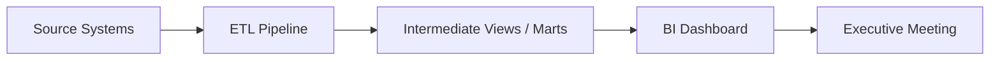
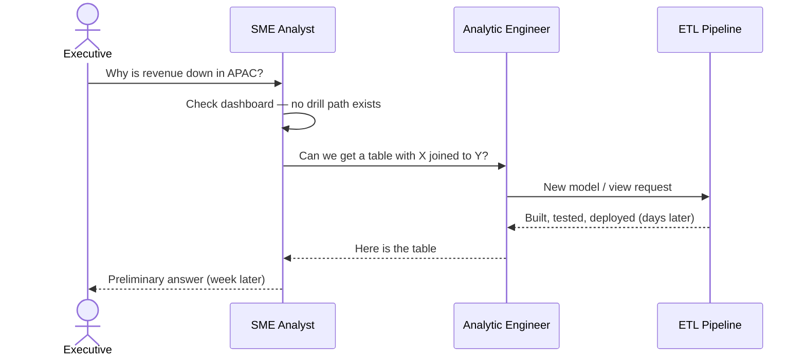

<br>

Most enterprise analytics still runs on a model built for a world where you know the questions before you know the answers. AI changes what becomes possible — but only if the architecture changes with it. This post lays out that shift in five parts: where we came from, where we're going, and the two ideas — semantic binding and the virtual knowledge graph — that connect them.

For hands-on technical depth on how I've been exploring these ideas, see my [Enterprise Graph series]().

# 1. The Pre-AI Model

To see why a new paradigm matters, it helps to be precise about the model it replaces. Take the classic business intelligence stack — the one most enterprises still run today. It follows a predictable shape:



The data engineer (or analytic engineer) owns the ETL contract: which tables get extracted, how they are joined, what grain the intermediate views land at. The subject-matter analyst owns the BI layer: which metrics appear on the dashboard, how they are sliced, what filters the executive team will want to toggle during the quarterly review. Everyone is doing their job. The pipeline is not broken.

The hidden assumption is that **the question must be known in advance**. Revenue by region, churn by cohort, pipeline by stage — these are not discovered at the meeting. They are negotiated weeks earlier, encoded into pipeline models and dashboard definitions, and rendered into charts that an analyst has already rehearsed. The dashboard is a preview of the conversation the organization expects to have.

That works when the numbers behave. Then one quarter, revenue dips in a region that was supposed to grow, or churn spikes in a cohort that looked healthy last month. The executive asks the question the dashboard was never built to answer: **"Why?"**

And that single word kicks off a second, slower pipeline:



The back-and-forth is slow — not because the people are slow, but because the architecture **front-loads all of the agreement before the question is known**. The ETL contract, the semantic definitions, the dashboard layout, the join paths — all of that was decided upstream, when the organization thought it knew what it would need to discuss. The "why?" question arrives downstream, after the fact, and every follow-up question pays the full cost of renegotiating that contract.

This is the pre-AI analytics model — what I'll call **ahead-of-time analytics** — in a sentence: **materialize the answers you expect; chase the answers you didn't.**

# 2. Just-In-Time Analytics

Just-In-Time Analytics is, simply, **business intelligence that happens on the fly** — at the moment the question is asked — rather than through the ahead-of-time path from source system to pipeline to dashboard that we described in Section 1. There is no weeks-long lead time. There is no ticket to the analytic engineering backlog. The question and the answer share the same moment.

What makes this possible now is AI — specifically, large language models and agentic tools with three capabilities that the ahead-of-time pipeline never had:

*   **Write and execute code.** The agent can compose and run the work itself — SQL against a warehouse, Python for analysis, a structured query, or a call to an external tool — without a human in the loop for every step.
*   **Interface in natural language.** People who don't write code can still get rigorous answers. An executive asks in plain English; the agent handles the translation to whatever the data layer requires.
*   **Probe assumptions and hypotheses interactively.** Through back-and-forth dialogue, an analyst, executive, or anyone else can reformulate a question, validate their thinking, invalidate a hunch, or follow a thread of exploratory analysis in real time — without waiting for an ETL job to finish or for someone on another team to get back to them.

But this is not just a better tool for analysts. That framing still assumes analytics is something specialists do on behalf of everyone else. Just-In-Time Analytics collapses that boundary.

Picture a CEO, CFO, or CMO at a Starbucks with a laptop, killing time before a flight. They wonder why churn ticked up last month in a segment that looked stable. In the ahead-of-time model, that curiosity dies on the vine — or becomes a Slack message that starts a multi-day chain. In the Just-In-Time model, they type the question in plain language and go back to their coffee. The agent does the work a team would have done: find the relevant data, write the query, run it, read the results, sketch a view, ask a clarifying follow-up, refine, and summarize. By the time the barista calls their name, they have an answer — or at least a working hypothesis worth bringing to the next meeting.

But the difference between ahead-of-time analytics and Just-In-Time Analytics is not just a change in speed. Speed is the visible symptom. The deeper change is in how the organization works.

**Process.** An ahead-of-time organization routes every new question through a request: spec a pipeline, commission a dashboard, wait for a handoff. A Just-In-Time organization has to change its processes to support a different assumption — that people at the point of the question can ask it directly, without filing a request and waiting for someone else to build the answer. That means different governance, different access patterns, and different expectations about who is allowed to reach into data. The organization has to catch up to the fact that curiosity no longer waits in a queue.

**Skillset.** The subject-matter analyst who sits closest to the business previously had to keep bothering other teams every time the work required code they couldn't write themselves — a script, a join, an analysis they didn't have the tooling to run. With an agent in the loop, they have the option to do that work on their own, or at least get far enough without a handoff. That matters because proximity to the business is the thing no engineering team can substitute for. The analyst knows whether a number smells wrong. They know which hypothesis is worth probing and which is a dead end. Just-In-Time Analytics doesn't replace that judgment — it finally puts the tools within reach of the person who has it.

## What Just-In-Time Analytics is not

We should also be clear about what this paradigm is **not**.

Just-In-Time Analytics is exploratory by nature. It shines when people ask probing questions — slicing, dicing, cohorting different segments, following a thread that no standing dashboard and no standing pipeline ever anticipated. But exploratory does not mean indeterminate. It does not mean every term is up for reinterpretation at the moment, subject to whoever is asking or however they phrase the question.

Every organization has core business concepts that carry a fixed, agreed-upon meaning — **revenue**, **customer**, **active user**, **churn**, **retention** — with real financial and operational consequences. Revenue is not a casual word. It is a definition that carries a story told to the board, to investors, to regulators, to the executive team. If an AI agent queries a revenue figure one way on Monday and an active-user count a slightly different way on Tuesday, and the two answers are inconsistent with what the organization has officially committed to, that is not a harmless quirk of exploration. That is a meeting with your manager. That is a restatement. That is scrutiny you cannot afford.

This is exactly the problem Just-In-Time Analytics has to solve — and it is the problem that shows us a large language model alone is insufficient. Ask an LLM to calculate revenue or count active users from scratch, with no grounding beyond its training data, and you are gambling on probabilistic fluency, not organizational truth. Even a modest hallucination rate — say, one wrong answer in ten — means one in ten queries returns something plausible but wrong. Active users might appear to grow or shrink by five or ten percent depending on nothing more than how the question was phrased. For metrics that move markets, headcount decisions, and regulatory filings, that is a grave problem.

Exploration needs freedom. Definitions need rigor. Just-In-Time Analytics has to deliver both — and that tension is what the next two sections address.

That is the shift. Analytics is no longer a batch artifact prepared in advance for a scheduled conversation. It is a live capability — available to whoever has the question, whenever they have it, in whatever pocket of downtime they happen to be sitting in.

Ahead-of-time analytics materialized the answers you expected. Just-In-Time Analytics lets you **ask the answers you didn't**.

# 3. Semantic Binding

The problem we ended Section 2 with — plausible but inconsistent answers, metrics that shift with phrasing, definitions that cannot be left to chance — has a direct architectural consequence: **Just-In-Time Analytics cannot run on raw text-to-SQL. Period.**

Raw text-to-SQL is the obvious shortcut. Many data warehouses and off-the-shelf analytics products already attempt it: hand the model a natural language question, let it inspect the schema, write SQL, return a number. It feels fast. The SQL looks reasonable. The answer arrives before your coffee gets cold. For a quick personal lookup or a sandbox experiment, that may be fine.

For enterprise-scale Just-In-Time Analytics, it is not. A model guessing its way from English to SQL against raw table and column names has no anchor to what **revenue** or **active user** officially means in your organization. It improvises joins, picks filters, and interprets edge cases on the fly — differently each time, depending on phrasing, context window, and mood. That is low fidelity, low accuracy, and high risk. It behaves closer to a **helper tool** — useful for drafting, brainstorming, orienting yourself in unfamiliar data — than to **production analytics** you would stake a board deck, an investor call, or a regulatory filing on.

This is where a lot of developers — and a lot of organizations — get confused. Text-to-SQL tools are everywhere now, and it is easy to look at one, see a plausible answer come back in seconds, and anchor your entire analytics strategy around it. But that misreads what the tool is for. Text-to-SQL is probably best understood as a way to **explore a relational database** — to orient yourself in unfamiliar schemas, draft a query, figure out which tables join to which while you are building a pipeline. It is a tool for the ETL phase: discovering structure, prototyping transforms, getting a feel for the data before you commit to a definition. That is useful work. It is just not Just-In-Time Analytics. Conflating the two is how organizations end up with fast, fluent answers that nobody can reconcile when the numbers matter.

Semantic binding is what closes that gap.

In ahead-of-time analytics, the binding between a business concept and its computation was implicit — locked inside a pipeline job, an intermediate model, a dashboard tile that someone built weeks before the question arrived. The definition was fixed, but only for the questions someone already anticipated.

Semantic binding makes that agreement **explicit and durable**, decoupled from any single dashboard or pipeline. The organization declares, once and in a reviewable form, what `Revenue` means: which sources it draws from, which filters apply, which grain it is computed at, how it relates to `Customer` or `Active User`. That declaration is the binding — a durable contract between domain meaning and physical data. When an agent answers a Just-In-Time question, it does not invent the definition at query time. It resolves the question against a binding the organization has already stood behind.

Here is what that looks like in practice. The W3C **R2RML** (RDB to RDF Mapping Language) standard is one way to write semantic bindings: each mapping connects an ontological concept to a **logical table** — a SQL query that encodes the official definition. The `rdfs:comment` on each mapping is not decoration; it is the organizational story behind the number, visible to reviewers, auditors, and the agent alike.

```turtle
@prefix rr:    <http://www.w3.org/ns/r2rml#> .
@prefix rdfs:  <http://www.w3.org/2000/01/rdf-schema#> .
@prefix xsd:   <http://www.w3.org/2001/XMLSchema#> .
@prefix ex:     <http://example.com/ontology#> .

# ------------------------------------------------------------
# Customer — active paying customer, not trial or churned
# ------------------------------------------------------------

<#Customer>
    a rr:TriplesMap ;
    rdfs:label "Customer" ;
    rdfs:comment """A paying customer with at least one completed order and an active
        subscription. Excludes trial accounts and churned accounts with no active plan.
        Source of truth for customer-count metrics in board reporting.""" ;

    rr:logicalTable [ rr:sqlQuery """
        SELECT customer_id, email, signup_date, region
        FROM   analytics.customers
        WHERE  lifecycle_status = 'active'
          AND  has_completed_order = TRUE
    """ ] ;

    rr:subjectMap [
        rr:template "http://example.com/customer/{customer_id}" ;
        rr:class    ex:Customer
    ] ;

    rr:predicateObjectMap [
        rr:predicate ex:signupDate ;
        rr:objectMap [ rr:column "signup_date" ; rr:datatype xsd:date ]
    ] ;
    rr:predicateObjectMap [
        rr:predicate ex:region ;
        rr:objectMap [ rr:column "region" ; rr:datatype xsd:string ]
    ] .


# ------------------------------------------------------------
# Active User — trailing 30-day session activity
# ------------------------------------------------------------

<#ActiveUser>
    a rr:TriplesMap ;
    rdfs:label "Active User" ;
    rdfs:comment """A user with at least one authenticated session in the trailing
        30 days. Matches the definition committed to in the Q4 investor deck.
        Do not substitute daily logins or page views — this binding is the definition.""" ;

    rr:logicalTable [ rr:sqlQuery """
        SELECT u.user_id, u.signup_date
        FROM   analytics.users u
        JOIN   analytics.sessions s ON u.user_id = s.user_id
        WHERE  s.session_start >= CURRENT_DATE - INTERVAL '30' DAY
        GROUP BY u.user_id, u.signup_date
    """ ] ;

    rr:subjectMap [
        rr:template "http://example.com/active-user/{user_id}" ;
        rr:class    ex:ActiveUser
    ] ;

    rr:predicateObjectMap [
        rr:predicate ex:signupDate ;
        rr:objectMap [ rr:column "signup_date" ; rr:datatype xsd:date ]
    ] .


# ------------------------------------------------------------
# Revenue — recognized net revenue, daily grain
# ------------------------------------------------------------

<#Revenue>
    a rr:TriplesMap ;
    rdfs:label "Revenue" ;
    rdfs:comment """Recognized net revenue at daily grain. Includes completed orders
        only. Excludes refunds, chargebacks, and tax. This is the number told to the
        board, investors, and regulators — not gross bookings or pipeline value.""" ;

    rr:logicalTable [ rr:sqlQuery """
        SELECT reporting_date,
               SUM(net_amount) AS total_revenue
        FROM   analytics.recognized_revenue
        WHERE  status = 'recognized'
        GROUP BY reporting_date
    """ ] ;

    rr:subjectMap [
        rr:template "http://example.com/revenue/{reporting_date}" ;
        rr:class    ex:Revenue
    ] ;

    rr:predicateObjectMap [
        rr:predicate ex:amount ;
        rr:objectMap [ rr:column "total_revenue" ; rr:datatype xsd:decimal ]
    ] ;
    rr:predicateObjectMap [
        rr:predicate ex:reportingDate ;
        rr:objectMap [ rr:column "reporting_date" ; rr:datatype xsd:date ]
    ] .
```

Notice what is happening in each mapping. The SQL is not improvised at query time — it *is* the definition. The filters (`lifecycle_status = 'active'`, trailing 30-day sessions, recognized revenue excluding refunds) are negotiated once, reviewed once, and bound once. When an executive asks "what is our active user count?" or "what was revenue last quarter?", the agent does not guess which tables to join. It resolves `ex:ActiveUser` or `ex:Revenue` against a binding the organization has already stood behind.

Exploration stays free at the edges — but **at the edges only**. The bindings fix the center; composition happens around them. Here is a concrete thread using the three mappings above.

Suppose the headline number comes back wrong: active users dropped twelve percent month-over-month. Nobody built a dashboard for this — it is a Just-In-Time question. The executive starts probing:

1. **"How many active users do we have right now?"** The agent counts instances of `ex:ActiveUser` — nothing more, nothing less. The trailing 30-day session filter from the `<#ActiveUser>` binding applies exactly as written. The agent does not quietly broaden the definition to "anyone who logged in once" or narrow it to "paid subscribers only."

2. **"Break that down by signup cohort."** Same binding, new grouping. The agent groups `ex:ActiveUser` instances by `ex:signupDate` month. Still the official active-user definition — just sliced along a dimension already exposed in the mapping. No renegotiation of what "active" means.

3. **"Is this concentrated in APAC?"** Now the agent composes across bindings. It joins `ex:ActiveUser` to `ex:Customer` on identity, filters on `ex:region = 'APAC'`, and counts. The `<#Customer>` binding still owns who counts as a customer; the `<#ActiveUser>` binding still owns what counts as active. The exploration is a join and a filter, not a new definition invented for one region.

4. **"Did revenue move in the same period?"** The agent pivots to `ex:Revenue`, sums `ex:amount` over the same reporting window, still excluding refunds and chargebacks per the `<#Revenue>` binding. A thread no standing pipeline anticipated — revenue crossed with an active-user investigation — but both numbers remain reconcilable to what the board was told last quarter.

5. **"What if we counted anyone with a session in the last seven days instead?"** This is where the agent should stop and escalate — not silently run a different query. That is a **definition change**, not an exploration. It requires a new binding, a review, and an explicit decision. The edge is free; the core is not.

That is the distinction. Raw text-to-SQL treats every follow-up as a fresh improvisation over raw tables. Semantic binding treats follow-ups one through four as **composition over fixed building blocks** — cohorting, filtering, joining, and time-slicing concepts the organization has already stood behind. Revenue is still recognized net revenue. Active user is still trailing 30-day authenticated sessions. The agent explores freely precisely because it was never asked to redefine them.

That is the split worth internalizing: raw text-to-SQL asks the model to be both analyst and definitional authority in a single shot. Semantic binding separates those roles. The organization owns the definitions. The agent owns the composition. Just-In-Time Analytics becomes trustworthy not because the model stopped hallucinating, but because it was never asked to define the metrics in the first place.

For terminology and a deeper treatment of how semantic binding differs from schema and ontology — including worked examples of how the same physical tables can be bound in different ways — see [Part 10: Appendix — Glossary]() and [Part 11: Appendix — Graph-SQL Mapping]().

# 4. Virtual Knowledge Graph

Section 3 showed semantic binding in action — R2RML mappings that pin `Revenue`, `ActiveUser`, and `Customer` to SQL the organization has already agreed on. A word of caution before we go further: a knowledge graph is **not** something we force on users to accept. It is not an architectural choice we make because we enjoy looking at things as graphs, or because graph databases are fashionable. Nobody sat down and said, "let's do knowledge graphs." The knowledge graph is a **logical consequence** — an entailment — of doing Just-In-Time Analytics with semantic binding. Get those two right, and the graph is already there.

To see why, pause on the words *semantic binding* themselves.

**Semantic** means about meaning. **Binding** means mapping one thing to another. So when we say *semantic binding*, what maps to what?

The answer: semantic binding maps a **logical table** — the relational data where rows actually live — to a **semantic term**, an ontological entity like `ex:Revenue`, `ex:ActiveUser`, or `ex:Customer`. In the R2RML block above, the `rr:logicalTable` with its `rr:sqlQuery` is the logical table side. The `rr:class ex:Revenue` (or `ex:ActiveUser`, `ex:Customer`) is the ontology side. The binding is the bridge between them: *this SQL is what we mean when we say Revenue.*

Those entities — active user, customer, revenue, churn, retention — are not just labels. Collectively, they are the **ontology**: the organization's formal vocabulary of what exists in the business and how those things relate. An active user is linked to a customer. Revenue is reported on a date. Churn is defined relative to a customer lifecycle. These are relationships between ontology classes, and relationships, taken together, form a **graph**. You did not set out to draw a graph. You set out to bind meaning to data — and a graph is what falls out.

So semantic binding is doing something deeper than attaching friendly names to columns. It is **binding physical relational data to an ontology** — and because the ontology classes connect to one another, it is binding relational data into **graph form**. Nodes are concepts. Edges are the relations the organization has declared between them. The agent in Section 3's exploration thread was not joining raw tables called `users` and `customers`; it was traversing a path from `ex:ActiveUser` to `ex:Customer` to `ex:region` — a graph path grounded in bindings, not improvisation.

Here is the step that completes the picture: a **virtual knowledge graph** is not a separate product decision — it is the structure that necessarily emerges when you write semantic bindings.

*Virtual* because the data never moves. Revenue still lives in `analytics.recognized_revenue`. Users still live in `analytics.users`. No one copies millions of rows into a separate graph database, runs a nightly sync job, or worries about the graph going stale the moment the warehouse refreshes. The graph exists as meaning and mapping — ontology plus bindings — layered over data that stays where it already is.

*Knowledge graph* because the result is navigable structure: entities, properties, and relationships that an agent (or a human) can traverse, compose, and query in domain terms rather than in DDL. The exploration in Section 3 — cohort active users, join to customers by region, pivot to revenue in the same window — is graph traversal expressed through bound concepts, executed against relational storage at query time. The user never had to "adopt a graph." They asked questions. The graph was the entailment.

The language of semantic binding in the example above is **R2RML** — **R**elational database to **R**DF **M**apping **L**anguage. It is a W3C standard format for declaring how a logical table in a relational database maps to entities and properties in an RDF graph. The `rr:logicalTable` side is the relational world; the `rr:class` and `rr:predicateObjectMap` side is the RDF world. When you write R2RML, you are not merely documenting SQL — you are authoring the virtual knowledge graph that Just-In-Time Analytics requires, whether or not anyone calls it that.

Just-In-Time Analytics, semantic binding, and the virtual knowledge graph are not three separate ideas you pick from a menu. They are one architecture seen from three angles — and the graph is the angle you get for free. Just-In-Time Analytics is the *when* — answers at the moment the question is asked. Semantic binding is the *mechanism* — physical data mapped to ontological meaning. The virtual knowledge graph is the *consequence* — the traversable structure that follows when bound entities relate to one another, without copying data out of the warehouse.

## From SQL tables to SPARQL to graph

To make this concrete, take the exploration question from Section 3: **"Is the active-user drop concentrated in APAC?"** Below are the relational source tables where the data actually lives, the SPARQL a user (or agent) writes against the virtual graph, the SQL the engine reformulates against those tables, and the graph-shaped answer that comes back.

**Source tables** — rows in the warehouse, untouched:

```sql
-- analytics.customers
SELECT * FROM analytics.customers;
-- customer_id | signup_date | region | lifecycle_status | has_completed_order
-- C001        | 2024-01-15  | APAC   | active           | true
-- C002        | 2023-06-01  | EMEA   | active           | true
-- C003        | 2024-03-10  | APAC   | active           | true

-- analytics.users  (user_id aligns with customer_id in this example)
SELECT * FROM analytics.users;
-- user_id | signup_date
-- C001    | 2024-01-15
-- C002    | 2023-06-01
-- C003    | 2024-03-10

-- analytics.sessions  (trailing 30-day window)
SELECT * FROM analytics.sessions;
-- user_id | session_start
-- C001    | 2025-05-20
-- C002    | 2025-05-18
-- C003    | 2025-05-22

-- analytics.recognized_revenue
SELECT reporting_date, SUM(net_amount) AS total_revenue
FROM   analytics.recognized_revenue
WHERE  status = 'recognized'
GROUP BY reporting_date;
-- reporting_date | total_revenue
-- 2025-05-01     | 125000.00
```

**SPARQL** — asked in domain terms against the virtual knowledge graph (bindings from Section 3):

```sparql
PREFIX ex:  <http://example.com/ontology#>
PREFIX xsd: <http://www.w3.org/2001/XMLSchema#>

CONSTRUCT {
  ?au a ex:ActiveUser ;
      ex:signupDate ?auSignup .
  ?cust a ex:Customer ;
        ex:region ?region .
  ?au ex:accountHolder ?cust .
  ?rev a ex:Revenue ;
       ex:amount ?amount ;
       ex:reportingDate ?revDate .
}
WHERE {
  ?au a ex:ActiveUser ;
      ex:signupDate ?auSignup .
  ?cust a ex:Customer ;
        ex:region "APAC" .
  ?au ex:accountHolder ?cust .
  ?rev a ex:Revenue ;
       ex:amount ?amount ;
       ex:reportingDate ?revDate .
  FILTER (?revDate = "2025-05-01"^^xsd:date)
}
```

The query never mentions `analytics.users`, `analytics.customers`, or join keys. It traverses bound concepts: find `ex:ActiveUser` instances, follow `ex:accountHolder` to `ex:Customer` filtered to `ex:region "APAC"`, and attach `ex:Revenue` for the same reporting window. The ontology property `ex:accountHolder` declares how the two bindings relate (here, shared identity between user and customer).

**Reformulated SQL** — what the virtual knowledge graph engine translates the SPARQL into at query time, unfolding the R2RML bindings:

```sql
SELECT
    u.user_id,
    u.signup_date        AS au_signup,
    c.customer_id,
    c.region,
    r.reporting_date,
    r.total_revenue
FROM (
    -- logical table from <#ActiveUser> binding
    SELECT u.user_id, u.signup_date
    FROM   analytics.users u
    JOIN   analytics.sessions s ON u.user_id = s.user_id
    WHERE  s.session_start >= CURRENT_DATE - INTERVAL '30' DAY
    GROUP BY u.user_id, u.signup_date
) u
JOIN (
    -- logical table from <#Customer> binding
    SELECT customer_id, signup_date, region
    FROM   analytics.customers
    WHERE  lifecycle_status = 'active'
      AND  has_completed_order = TRUE
) c ON u.user_id = c.customer_id
   AND c.region = 'APAC'
CROSS JOIN (
    -- logical table from <#Revenue> binding
    SELECT reporting_date, SUM(net_amount) AS total_revenue
    FROM   analytics.recognized_revenue
    WHERE  status = 'recognized'
    GROUP BY reporting_date
) r
WHERE r.reporting_date = DATE '2025-05-01';
```

Note what happened: the `<#ActiveUser>`, `<#Customer>`, and `<#Revenue>` bindings supplied the subqueries and their filters. The SPARQL graph pattern supplied the join (`ex:accountHolder`) and the regional filter. No one wrote this SQL by hand at the Starbucks — it was entailed by bindings plus query.

**Graph answer** — the CONSTRUCT result, rendered as nodes and edges (C002 in EMEA is an active user in the source tables but absent from this graph because the query filtered to APAC):

<div style="display: flex; justify-content: center; margin: 2rem 0;">
<svg viewBox="0 0 720 420" width="100%" style="max-width: 720px; font-family: sans-serif; background: #fafafa; border: 1px solid #e0e0e0; border-radius: 8px;">
  <defs>
    <marker id="arrow" markerWidth="8" markerHeight="8" refX="7" refY="3" orient="auto">
      <path d="M0,0 L7,3 L0,6 Z" fill="#666"/>
    </marker>
  </defs>

  <text x="360" y="28" text-anchor="middle" font-size="14" font-weight="bold" fill="#333">SPARQL CONSTRUCT result — virtual knowledge graph answer</text>

  <!-- ActiveUser nodes -->
  <circle cx="120" cy="120" r="44" fill="#e8f5e9" stroke="#2e7d32" stroke-width="2"/>
  <text x="120" y="112" text-anchor="middle" font-size="11" font-weight="bold" fill="#2e7d32">ActiveUser</text>
  <text x="120" y="128" text-anchor="middle" font-size="10" fill="#333">C001</text>
  <text x="120" y="142" text-anchor="middle" font-size="9" fill="#666">signup 2024-01-15</text>

  <circle cx="120" cy="280" r="44" fill="#e8f5e9" stroke="#2e7d32" stroke-width="2"/>
  <text x="120" y="272" text-anchor="middle" font-size="11" font-weight="bold" fill="#2e7d32">ActiveUser</text>
  <text x="120" y="288" text-anchor="middle" font-size="10" fill="#333">C003</text>
  <text x="120" y="302" text-anchor="middle" font-size="9" fill="#666">signup 2024-03-10</text>

  <!-- Customer nodes -->
  <circle cx="340" cy="120" r="44" fill="#e3f2fd" stroke="#1565c0" stroke-width="2"/>
  <text x="340" y="112" text-anchor="middle" font-size="11" font-weight="bold" fill="#1565c0">Customer</text>
  <text x="340" y="128" text-anchor="middle" font-size="10" fill="#333">C001</text>

  <circle cx="340" cy="280" r="44" fill="#e3f2fd" stroke="#1565c0" stroke-width="2"/>
  <text x="340" y="272" text-anchor="middle" font-size="11" font-weight="bold" fill="#1565c0">Customer</text>
  <text x="340" y="288" text-anchor="middle" font-size="10" fill="#333">C003</text>

  <!-- Revenue node -->
  <circle cx="580" cy="200" r="50" fill="#fff3e0" stroke="#e65100" stroke-width="2"/>
  <text x="580" y="188" text-anchor="middle" font-size="11" font-weight="bold" fill="#e65100">Revenue</text>
  <text x="580" y="204" text-anchor="middle" font-size="10" fill="#333">2025-05-01</text>
  <text x="580" y="220" text-anchor="middle" font-size="10" fill="#333">$125,000</text>

  <!-- Region literals -->
  <rect x="430" y="100" width="72" height="28" rx="4" fill="#f5f5f5" stroke="#999"/>
  <text x="466" y="118" text-anchor="middle" font-size="10" fill="#555">"APAC"</text>
  <rect x="430" y="260" width="72" height="28" rx="4" fill="#f5f5f5" stroke="#999"/>
  <text x="466" y="278" text-anchor="middle" font-size="10" fill="#555">"APAC"</text>

  <!-- Edges -->
  <line x1="164" y1="120" x2="296" y2="120" stroke="#666" stroke-width="1.5" marker-end="url(#arrow)"/>
  <text x="230" y="110" text-anchor="middle" font-size="9" fill="#666">ex:accountHolder</text>

  <line x1="164" y1="280" x2="296" y2="280" stroke="#666" stroke-width="1.5" marker-end="url(#arrow)"/>
  <text x="230" y="270" text-anchor="middle" font-size="9" fill="#666">ex:accountHolder</text>

  <line x1="384" y1="120" x2="430" y2="114" stroke="#666" stroke-width="1.5" marker-end="url(#arrow)"/>
  <text x="400" y="108" text-anchor="middle" font-size="9" fill="#666">ex:region</text>

  <line x1="384" y1="280" x2="430" y2="274" stroke="#666" stroke-width="1.5" marker-end="url(#arrow)"/>
  <text x="400" y="298" text-anchor="middle" font-size="9" fill="#666">ex:region</text>

  <!-- Legend -->
  <rect x="40" y="360" width="14" height="14" fill="#e8f5e9" stroke="#2e7d32"/>
  <text x="60" y="372" font-size="10" fill="#333">ex:ActiveUser</text>
  <rect x="160" y="360" width="14" height="14" fill="#e3f2fd" stroke="#1565c0"/>
  <text x="180" y="372" font-size="10" fill="#333">ex:Customer</text>
  <rect x="270" y="360" width="14" height="14" fill="#fff3e0" stroke="#e65100"/>
  <text x="290" y="372" font-size="10" fill="#333">ex:Revenue</text>
  <text x="400" y="372" font-size="10" fill="#888">C002 (EMEA) active in SQL — absent from graph (APAC filter)</text>
</svg>
</div>

The relational tables stayed in the warehouse. The SPARQL was written in ontology terms. The SQL was generated from bindings. The answer came back as a graph. That pipeline — source tables, semantic bindings, SPARQL in, graph out — is the virtual knowledge graph in one picture.

## What the virtual knowledge graph is not

We should be equally clear about what *virtual* does **not** mean.

A virtual knowledge graph is **not** just another database you have to stand up, materialize, and keep in sync. It is not a graph database. There is no ETL job that copies rows out of your warehouse into nodes and edges. There is no second store lagging behind the first, no nightly sync, no duplicate dataset cluttering a separate cluster. If you have lived through a "let's load everything into a graph database" migration, that is the opposite of what we mean here.

This is a **zero-copy architecture**. Your data stays exactly where it already is — in SQL tables, in a document store, in a lakehouse, in whatever NoSQL system owns the source of truth. Nothing moves. Nothing is duplicated for the sake of graph shape.

The graph is a **logical construction** — nothing more, nothing less. You write semantic bindings; the bindings declare how ontological entities and relationships map to physical storage; a query engine resolves graph-shaped questions against that mapping at runtime. The graph exists when you need it, in the answer, not as a permanent copy sitting in another database.

That is what *virtual* means in virtual knowledge graph: graph semantics without graph storage. The entailment of Just-In-Time Analytics and semantic binding — not another migration project.

## Why virtual knowledge graph wasn't popular before AI

If virtualization is so elegant, why wasn't everyone doing it already? Two reasons — and both come down to economics, not technology.

**Reason one: virtualization taxes every query.** Materialization pays the transformation cost once, in a big batch ETL job overnight. Virtualization pays a translation cost on every query — SPARQL to SQL, binding resolution, reformulation against source tables. In the ahead-of-time world, that tax bought you nothing. Your BI dashboard was already hitting a pre-built view from a pipeline that ran last night. Adding ten seconds of translation latency to a dashboard that loads in one second is pure downside. You materialized precisely *because* you wanted to stop paying per query.

**Reason two: ETL was mandatory anyway.** In ahead-of-time analytics, you had no choice but to run a pipeline — source to warehouse to mart to dashboard. If you were already paying for ETL, the marginal cost of materializing one more copy into a shape your BI tool could slice was low. Batch it once, serve it a thousand times. Virtualization would have meant paying translation costs *on top of* an ETL stack you still needed to maintain. Materialize and be done made obvious sense.

So virtualization sat on the shelf — technically viable, economically wrong for the pre-AI workflow.

**The value reversal.** AI agents change the accounting completely. The limiting factor has moved. ETL tooling is mature; assembling data in batch is not the bottleneck anymore. The bottleneck is **how fast a question can be answered** — especially a question nobody anticipated, that no dashboard was built for, that no pipeline was scoped for.

In Section 1, we traced that bottleneck: an analyst scopes the question, files a ticket, an analytic engineer specs a table, a data engineer runs a pipeline — a day at minimum, often a week. That is the cost that dominates the experience. Virtualization adds seconds per query. The old ETL cycle costs days per question.

The AI agent collapses that cycle. With semantic bindings and a virtual knowledge graph, the same hypothesis — *is the active-user drop concentrated in APAC?* — can be explored in minutes, in natural language, without a ticket and without a new pipeline. Virtualization is no longer a tax on a fast BI dashboard. It is the mechanism that makes Just-In-Time Analytics possible at all.

This also reframes the latency comparison. In the BI era, slicing a pre-materialized view in one second set the expectation. Virtualization's extra seconds felt like a regression. In the agentic era, the user asks in plain language and waits thirty seconds to a minute for the answer to stream back. Adding ten more seconds for binding translation barely registers. **Query latency is the wrong thing to optimize against.** What changes the experience is waiting a day for someone to build the table — not whether the virtual graph answer arrives in forty seconds instead of thirty.

That is the value reversal AI created. Materialization optimized for repeated reads of known questions. Virtualization optimizes for unknown questions asked once, right now — which is exactly what agents and executives at Starbucks keep asking.

The ahead-of-time model materialized answers. The Just-In-Time model materializes **meaning** — and lets the answers follow.

For how structured data integration fits into a broader knowledge graph architecture, see [Part 6: Dealing with Structured Relational Data](). For the technical machinery of query-time translation over bindings, see [Part 11: Appendix — Graph-SQL Mapping]().

# 5. Summary

This post traced a single architectural arc: from the ahead-of-time analytics most enterprises still run, through the Just-In-Time paradigm AI makes possible, to the semantic binding and virtual knowledge graph that make it trustworthy. The table below collects the concepts discussed and how they fit together.

| Concept | What it means | Role in this architecture |
| :--- | :--- | :--- |
| **Ahead-of-time analytics** | The pre-AI model: ETL → pipeline → dashboard → executive meeting. Questions must be known in advance; answers are materialized before they are asked. | The baseline this post argues against. Optimizes repeated reads of anticipated questions. Pays transformation cost once in batch. |
| **Just-In-Time Analytics** | Business intelligence at the moment the question is asked — not through a weeks-long ticket and pipeline cycle. | The *when*. Enabled by AI agents that write code, converse in natural language, and support interactive hypothesis probing. Changes org process and analyst skillset, not just speed. |
| **Semantic binding** | An explicit, durable mapping from a **logical table** (SQL where data lives) to an **ontological entity** (what the organization means by Revenue, Active User, Customer, etc.). | The *mechanism*. Separates who owns definitions (the organization) from who owns composition (the agent). Makes exploration free at the edges while keeping core metrics fixed. |
| **Ontology** | The formal vocabulary of business concepts and the relationships between them — active user linked to customer, revenue reported on a date. | The meaning layer semantic bindings attach to. Not chosen for graph aesthetics; it is what gives bindings something to bind *to*. |
| **Virtual knowledge graph** | A traversable graph of entities and relationships that exists as ontology plus bindings — not as a copied dataset in a graph database. | The *consequence*. Logical entailment of JIT analytics plus semantic binding. Graph semantics without graph storage. |
| **R2RML** | W3C Relational Database to RDF Mapping Language — a standard format for writing semantic bindings (`rr:logicalTable` → `rr:class`). | One way to author bindings and, therefore, the virtual knowledge graph. Makes definitions reviewable, versionable, and machine-readable. |
| **Logical table** | A SQL query (not necessarily a physical table) that encodes the official definition of a concept — filters, joins, grain included. | The relational side of a semantic binding. The SQL *is* the definition, not an improvisation at query time. |
| **Raw text-to-SQL** | An LLM writes SQL directly against a raw schema from natural language, with no binding layer. | Useful for ETL exploration and schema orientation — a **helper tool**, not production Just-In-Time Analytics. High risk of plausible but inconsistent answers. |
| **Composition** | Cohorting, filtering, joining, and time-slicing bound concepts without redefining them — e.g., active users in APAC by signup month. | What agents do at the edges. Distinct from a **definition change**, which requires a new binding and human review. |
| **Zero-copy architecture** | Data stays in SQL, NoSQL, or lakehouse storage. No ETL into a separate graph database. The graph is logical, not materialized. | What *virtual* means. Eliminates sync lag, duplicate storage, and stale graph copies. |
| **Materialization** | Copying and transforming data into a pre-built store (warehouse mart, graph database, dashboard view) ahead of query time. | The ahead-of-time default. Pays transformation once; optimizes fast repeated reads of known questions. |
| **Virtualization** | Translating graph- or semantic-shaped queries against bindings at query time, without copying source data. | Per-query translation cost that was uneconomical for BI dashboards but is now dwarfed by the day-long ETL ticket cycle agents eliminate. |
| **AI agent** | An LLM-powered tool that writes and executes queries, converses in natural language, and sustains back-and-forth dialogue. | Collapses the analyst → engineer → pipeline bottleneck. Reframes latency: seconds of translation matter less than days of waiting for a new table. |

Three sentences to take away:

**Ahead-of-time analytics** materialized the answers you expected and made you chase the ones you didn't. **Just-In-Time Analytics**, enabled by AI, inverts that timing — but only works if core metrics are grounded in **semantic bindings**, not raw text-to-SQL improvisation. Do that, and a **virtual knowledge graph** is not a product you adopt; it is the logical structure you were already building.

For deeper technical treatment, see the [Enterprise Graph series]() — especially [Part 6](), [Part 10](), and [Part 11]().

# Appendix: Advanced Semantic Binding

The bindings in Section 3 were deliberately simple — each concept mapped to roughly one logical table. But the whole point of semantic binding is that **a binding is not a mirror of your physical schema**. The number of bindings is driven by how many meaningful concepts exist in the domain, not by how many tables the database administrator created. A single ontological entity can be backed by a join across five tables, an aggregation, a filtered slice, or even a table joined to itself.

This appendix works through four binding patterns that are not one-to-one with tables. For each, we show the R2RML binding (the `rr:sqlQuery` is where the complexity lives), an example SPARQL query against the resulting virtual graph, and — where it clarifies the result — the graph shape or translated SQL.

The reassuring part: in every case, the *SPARQL stays simple*. The complexity is absorbed into the binding, declared once and reviewed once. The agent asking the question never sees the join, the aggregation, or the self-join. It just sees a clean ontological concept.

## A.1 — JOIN-collapsed binding (many tables → one concept)

A common pattern: the domain concept "Order" is a single idea, but the physical data is normalized across `orders`, `order_line_items`, `products`, and `customers`. Rather than expose four tables, one binding collapses the join and presents a single `ex:Order` entity with the attributes that matter to the business.

```turtle
<#Order>
    a rr:TriplesMap ;
    rdfs:label "Order" ;
    rdfs:comment """A completed customer order with its total value and product category.
        Collapses orders + order_line_items + products + customers into one concept.
        Total value is the line-item sum; category is the dominant product category.""" ;

    rr:logicalTable [ rr:sqlQuery """
        SELECT  o.order_id,
                o.order_date,
                c.customer_id,
                SUM(li.quantity * li.unit_price) AS order_total,
                MAX(p.category)                  AS primary_category
        FROM        orders            o
        JOIN        order_line_items  li ON li.order_id  = o.order_id
        JOIN        products          p  ON p.product_id = li.product_id
        JOIN        customers         c  ON c.customer_id = o.customer_id
        WHERE   o.status = 'completed'
        GROUP BY o.order_id, o.order_date, c.customer_id
    """ ] ;

    rr:subjectMap [
        rr:template "http://example.com/order/{order_id}" ;
        rr:class    ex:Order
    ] ;

    rr:predicateObjectMap [
        rr:predicate ex:orderTotal ;
        rr:objectMap [ rr:column "order_total" ; rr:datatype xsd:decimal ]
    ] ;
    rr:predicateObjectMap [
        rr:predicate ex:primaryCategory ;
        rr:objectMap [ rr:column "primary_category" ; rr:datatype xsd:string ]
    ] ;
    rr:predicateObjectMap [
        rr:predicate ex:placedBy ;
        rr:objectMap [ rr:template "http://example.com/customer/{customer_id}" ]
    ] .
```

The four-table join, the line-item summation, and the `status = 'completed'` filter all live inside the binding. The agent querying for orders over $500 writes this:

```sparql
PREFIX ex: <http://example.com/ontology#>

SELECT ?order ?total ?category
WHERE {
  ?order a ex:Order ;
         ex:orderTotal ?total ;
         ex:primaryCategory ?category .
  FILTER (?total > 500)
}
```

No mention of `order_line_items` or `products`. The join was a binding-author decision; the agent just sees `ex:Order`. This is the **JOIN-collapsed** strategy — powerful for read-simplicity, with the trade-off that the constituent tables (a single line item, a single product) are no longer first-class entities in the graph unless separately bound.

## A.2 — Aggregation binding (a rollup becomes an entity)

Sometimes the concept *is* an aggregate. "Monthly Recurring Revenue" or "Regional Sales Summary" has no single source row — it is a `GROUP BY`. The binding can mint an entity per aggregation group, turning a rollup into addressable graph nodes.

```turtle
<#RegionalSalesSummary>
    a rr:TriplesMap ;
    rdfs:label "Regional Sales Summary" ;
    rdfs:comment """One node per (region, month). Aggregates completed-order revenue.
        Grain is intentionally region-month — finer detail lives in ex:Order.""" ;

    rr:logicalTable [ rr:sqlQuery """
        SELECT  c.region,
                DATE_TRUNC('month', o.order_date) AS sales_month,
                COUNT(DISTINCT o.order_id)        AS order_count,
                SUM(o.order_total)                AS total_revenue
        FROM        orders     o
        JOIN        customers  c ON c.customer_id = o.customer_id
        WHERE   o.status = 'completed'
        GROUP BY c.region, DATE_TRUNC('month', o.order_date)
    """ ] ;

    rr:subjectMap [
        rr:template "http://example.com/sales-summary/{region}/{sales_month}" ;
        rr:class    ex:RegionalSalesSummary
    ] ;

    rr:predicateObjectMap [
        rr:predicate ex:region ;
        rr:objectMap [ rr:column "region" ; rr:datatype xsd:string ]
    ] ;
    rr:predicateObjectMap [
        rr:predicate ex:salesMonth ;
        rr:objectMap [ rr:column "sales_month" ; rr:datatype xsd:date ]
    ] ;
    rr:predicateObjectMap [
        rr:predicate ex:orderCount ;
        rr:objectMap [ rr:column "order_count" ; rr:datatype xsd:integer ]
    ] ;
    rr:predicateObjectMap [
        rr:predicate ex:totalRevenue ;
        rr:objectMap [ rr:column "total_revenue" ; rr:datatype xsd:decimal ]
    ] .
```

The subject IRI template `{region}/{sales_month}` is the key trick: each aggregation group becomes a distinct, dereferenceable node. A query for the top regions in a month:

```sparql
PREFIX ex: <http://example.com/ontology#>

SELECT ?region ?revenue
WHERE {
  ?s a ex:RegionalSalesSummary ;
     ex:salesMonth "2025-05-01"^^<http://www.w3.org/2001/XMLSchema#date> ;
     ex:region ?region ;
     ex:totalRevenue ?revenue .
}
ORDER BY DESC(?revenue)
```

The graph that results is a set of summary nodes — note that these nodes never existed as rows anywhere; they are materialized by the binding at query time:

<div style="display: flex; justify-content: center; margin: 2rem 0;">
<svg viewBox="0 0 640 260" width="100%" style="max-width: 640px; font-family: sans-serif; background: #fafafa; border: 1px solid #e0e0e0; border-radius: 8px;">
  <text x="320" y="28" text-anchor="middle" font-size="13" font-weight="bold" fill="#333">ex:RegionalSalesSummary — one node per (region, month)</text>

  <circle cx="140" cy="140" r="56" fill="#fff3e0" stroke="#e65100" stroke-width="2"/>
  <text x="140" y="128" text-anchor="middle" font-size="10" font-weight="bold" fill="#e65100">SalesSummary</text>
  <text x="140" y="144" text-anchor="middle" font-size="9" fill="#333">APAC / 2025-05</text>
  <text x="140" y="158" text-anchor="middle" font-size="9" fill="#666">$420,000 · 980 orders</text>

  <circle cx="320" cy="140" r="56" fill="#fff3e0" stroke="#e65100" stroke-width="2"/>
  <text x="320" y="128" text-anchor="middle" font-size="10" font-weight="bold" fill="#e65100">SalesSummary</text>
  <text x="320" y="144" text-anchor="middle" font-size="9" fill="#333">EMEA / 2025-05</text>
  <text x="320" y="158" text-anchor="middle" font-size="9" fill="#666">$310,000 · 640 orders</text>

  <circle cx="500" cy="140" r="56" fill="#fff3e0" stroke="#e65100" stroke-width="2"/>
  <text x="500" y="128" text-anchor="middle" font-size="10" font-weight="bold" fill="#e65100">SalesSummary</text>
  <text x="500" y="144" text-anchor="middle" font-size="9" fill="#333">AMER / 2025-05</text>
  <text x="500" y="158" text-anchor="middle" font-size="9" fill="#666">$560,000 · 1,210 orders</text>

  <text x="320" y="230" text-anchor="middle" font-size="10" fill="#888">These nodes exist only as the GROUP BY result — no physical row backs them.</text>
</svg>
</div>

The aggregation binding is how you give a name and an identity to something that is fundamentally a computation. The grain is a deliberate modeling choice baked into the `GROUP BY`.

## A.3 — Filtered bindings (one table → several subclasses)

A single physical table can back several ontological classes, each defined by a filter. This is the **role-filtered** pattern from Section 3's binding-strategy table, made concrete. The `employees` table has a `role` column; rather than expose `role` as a raw property, we promote the distinction into class membership.

```turtle
# Both classes draw from the SAME employees table, differing only by filter.

<#Manager>
    a rr:TriplesMap ;
    rdfs:label "Manager" ;
    rdfs:comment "Employees with role = 'Manager'. A subclass of ex:Employee." ;
    rr:logicalTable [ rr:sqlQuery """
        SELECT employee_id, name, department_id
        FROM   hr.employees
        WHERE  role = 'Manager'
    """ ] ;
    rr:subjectMap [
        rr:template "http://example.com/employee/{employee_id}" ;
        rr:class    ex:Manager
    ] ;
    rr:predicateObjectMap [
        rr:predicate ex:manages ;
        rr:objectMap [ rr:template "http://example.com/department/{department_id}" ]
    ] .

<#IndividualContributor>
    a rr:TriplesMap ;
    rdfs:label "Individual Contributor" ;
    rdfs:comment "Employees with role <> 'Manager'. A subclass of ex:Employee." ;
    rr:logicalTable [ rr:sqlQuery """
        SELECT employee_id, name, department_id
        FROM   hr.employees
        WHERE  role <> 'Manager'
    """ ] ;
    rr:subjectMap [
        rr:template "http://example.com/employee/{employee_id}" ;
        rr:class    ex:IndividualContributor
    ] ;
    rr:predicateObjectMap [
        rr:predicate ex:worksIn ;
        rr:objectMap [ rr:template "http://example.com/department/{department_id}" ]
    ] .
```

With the ontology declaring both `ex:Manager` and `ex:IndividualContributor` as subclasses of `ex:Employee`, an OBDA engine with OWL 2 QL reasoning expands a query for the parent class to span both bindings. So "list everyone" stays a one-liner:

```sparql
PREFIX ex: <http://example.com/ontology#>

SELECT ?emp ?name
WHERE {
  ?emp a ex:Employee ;     # reasoning expands to Manager + IndividualContributor
       ex:name ?name .
}
```

To target just one role, query the subclass directly (`?emp a ex:Manager`). The filter that distinguishes them lives in the binding, not in the query. A subtle but important consequence: because `ex:Manager` carries a different outgoing edge (`ex:manages`) than `ex:IndividualContributor` (`ex:worksIn`), the *role distinction is now encoded in the graph topology itself* rather than as a string property — which is exactly what makes ontological reasoning over it possible.

> For a deeper treatment of how subclass reasoning interacts with filtered bindings — including the pitfall where a `schema:Person` query unexpectedly includes or excludes a subclass depending on whether reasoning is enabled — see [Part 11: Appendix — Graph-SQL Mapping]().

## A.4 — Self-join binding (a table related to itself)

Hierarchies are the classic case: an `employees` table where each row has a `manager_id` pointing at another row in the same table. The relationship "reports to" is a self-join. A binding can expose this as a clean `ex:reportsTo` edge between `ex:Employee` nodes.

```turtle
<#ReportingLine>
    a rr:TriplesMap ;
    rdfs:label "Reporting Line" ;
    rdfs:comment """The reports-to relationship, derived from employees.manager_id
        referencing employees.employee_id (a self-join). Produces ex:reportsTo edges.""" ;

    rr:logicalTable [ rr:sqlQuery """
        SELECT  e.employee_id   AS report_id,
                m.employee_id   AS manager_id
        FROM        hr.employees e
        JOIN        hr.employees m ON e.manager_id = m.employee_id
    """ ] ;

    rr:subjectMap [
        rr:template "http://example.com/employee/{report_id}" ;
        rr:class    ex:Employee
    ] ;

    rr:predicateObjectMap [
        rr:predicate ex:reportsTo ;
        rr:objectMap [ rr:template "http://example.com/employee/{manager_id}" ]
    ] .
```

The self-join `e JOIN m ON e.manager_id = m.employee_id` is hidden behind a single predicate. Now graph traversal does what recursive SQL would otherwise require. "Who reports to Alice, directly or transitively?" becomes a property-path query:

```sparql
PREFIX ex: <http://example.com/ontology#>

SELECT ?report
WHERE {
  ?report ex:reportsTo+ <http://example.com/employee/alice> .
}
```

The `ex:reportsTo+` property path walks the chain to any depth — the kind of recursive traversal that is awkward in plain SQL but natural in a graph. The resulting structure is a reporting tree:

<div style="display: flex; justify-content: center; margin: 2rem 0;">
<svg viewBox="0 0 560 300" width="100%" style="max-width: 560px; font-family: sans-serif; background: #fafafa; border: 1px solid #e0e0e0; border-radius: 8px;">
  <defs>
    <marker id="arrow2" markerWidth="8" markerHeight="8" refX="7" refY="3" orient="auto">
      <path d="M0,0 L7,3 L0,6 Z" fill="#666"/>
    </marker>
  </defs>
  <text x="280" y="28" text-anchor="middle" font-size="13" font-weight="bold" fill="#333">ex:reportsTo — self-join surfaced as a graph edge</text>

  <circle cx="280" cy="70" r="34" fill="#e3f2fd" stroke="#1565c0" stroke-width="2"/>
  <text x="280" y="74" text-anchor="middle" font-size="11" fill="#1565c0">Alice</text>

  <circle cx="160" cy="180" r="34" fill="#e8f5e9" stroke="#2e7d32" stroke-width="2"/>
  <text x="160" y="184" text-anchor="middle" font-size="11" fill="#2e7d32">Bob</text>

  <circle cx="400" cy="180" r="34" fill="#e8f5e9" stroke="#2e7d32" stroke-width="2"/>
  <text x="400" y="184" text-anchor="middle" font-size="11" fill="#2e7d32">Carol</text>

  <circle cx="400" cy="270" r="30" fill="#f1f8e9" stroke="#558b2f" stroke-width="2"/>
  <text x="400" y="274" text-anchor="middle" font-size="10" fill="#558b2f">Dave</text>

  <line x1="172" y1="150" x2="258" y2="92" stroke="#666" stroke-width="1.5" marker-end="url(#arrow2)"/>
  <line x1="388" y1="150" x2="302" y2="92" stroke="#666" stroke-width="1.5" marker-end="url(#arrow2)"/>
  <line x1="400" y1="240" x2="400" y2="216" stroke="#666" stroke-width="1.5" marker-end="url(#arrow2)"/>
  <text x="210" y="120" text-anchor="middle" font-size="9" fill="#666">ex:reportsTo</text>
  <text x="470" y="120" text-anchor="middle" font-size="9" fill="#666">ex:reportsTo</text>
  <text x="446" y="232" text-anchor="middle" font-size="9" fill="#666">ex:reportsTo</text>

  <text x="280" y="292" text-anchor="middle" font-size="10" fill="#888">ex:reportsTo+ from Alice returns Bob, Carol, and Dave (transitive).</text>
</svg>
</div>

## A.5 — One query across every binding (the graph as a graph)

Each pattern above produced a small, local graph. The real payoff comes when a single question traverses *all of them at once* — join-collapsed orders, an aggregation summary, role-filtered employees, and a self-joined reporting line — and the virtual knowledge graph stitches them into one connected structure.

Consider an executive's Just-In-Time question: **"For our APAC sales department, show the manager, the individual contributors who report to them, the customers each rep serves, the high-value orders those customers placed, and tie it to the regional sales summary."** No dashboard was ever built for this. In the ahead-of-time world it would be a multi-day, multi-table modeling project. Against the virtual graph it is one query — and crucially, it still reads in clean ontological terms, even though under the hood it touches a four-table join (`ex:Order`), an aggregation (`ex:RegionalSalesSummary`), two filtered subclasses (`ex:Manager`, `ex:IndividualContributor`), and a self-join (`ex:reportsTo`).

```sparql
PREFIX ex: <http://example.com/ontology#>

CONSTRUCT {
  ?summary a ex:RegionalSalesSummary ; ex:region ?region ; ex:coversDepartment ?dept .
  ?mgr     a ex:Manager ;              ex:manages ?dept ;        ex:name ?mgrName .
  ?ic      a ex:IndividualContributor; ex:worksIn ?dept ;
                                       ex:reportsTo ?mgr ;        ex:name ?icName .
  ?cust    a ex:Customer ;             ex:servedBy ?ic ;         ex:region ?region .
  ?order   a ex:Order ;                ex:placedBy ?cust ;       ex:orderTotal ?total .
}
WHERE {
  # A.2 — aggregation binding
  ?summary a ex:RegionalSalesSummary ;
           ex:region ?region ;
           ex:coversDepartment ?dept .
  FILTER (?region = "APAC")

  # A.3 — filtered-subclass bindings (Manager vs IndividualContributor)
  ?mgr a ex:Manager ;
       ex:manages ?dept ;
       ex:name ?mgrName .
  ?ic  a ex:IndividualContributor ;
       ex:worksIn ?dept ;
       ex:reportsTo ?mgr ;             # A.4 — self-join binding
       ex:name ?icName .

  # A.1 — join-collapsed Order + Customer
  ?cust  a ex:Customer ; ex:servedBy ?ic ; ex:region ?region .
  ?order a ex:Order ;    ex:placedBy ?cust ; ex:orderTotal ?total .
  FILTER (?total > 500)
}
```

Every binding family appears in a single graph pattern. The engine reformulates this into a SQL statement that — once unfolded — contains the four-table order join, the region-month aggregation, two role filters, and a self-join of `employees`. That generated SQL would be dozens of lines and genuinely unpleasant to write by hand. The SPARQL is twenty lines of plain concept traversal.

And the result is unmistakably a *graph* — not a flat table, but a connected web of differently-typed nodes and labeled edges:

<div style="display: flex; justify-content: center; margin: 2rem 0;">
<svg viewBox="0 0 800 640" width="100%" style="max-width: 800px; font-family: sans-serif; background: #fafafa; border: 1px solid #e0e0e0; border-radius: 8px;">
  <defs>
    <marker id="arrow3" markerWidth="8" markerHeight="8" refX="7" refY="3" orient="auto">
      <path d="M0,0 L7,3 L0,6 Z" fill="#666"/>
    </marker>
  </defs>

  <text x="400" y="30" text-anchor="middle" font-size="14" font-weight="bold" fill="#333">One query, every binding — a connected virtual knowledge graph</text>

  <!-- Edges first (so nodes draw on top) -->
  <!-- Bob -> Alice reportsTo -->
  <line x1="258" y1="145" x2="368" y2="87" stroke="#666" stroke-width="1.5" marker-end="url(#arrow3)"/>
  <text x="300" y="108" text-anchor="middle" font-size="9" fill="#666">ex:reportsTo</text>
  <!-- Carol -> Alice reportsTo -->
  <line x1="561" y1="146" x2="433" y2="85" stroke="#666" stroke-width="1.5" marker-end="url(#arrow3)"/>
  <text x="505" y="108" text-anchor="middle" font-size="9" fill="#666">ex:reportsTo</text>
  <!-- Dave -> Carol reportsTo -->
  <line x1="671" y1="249" x2="612" y2="184" stroke="#666" stroke-width="1.5" marker-end="url(#arrow3)"/>
  <text x="680" y="222" text-anchor="middle" font-size="9" fill="#666">ex:reportsTo</text>
  <!-- Alice -> Dept manages -->
  <line x1="400" y1="106" x2="400" y2="156" stroke="#666" stroke-width="1.5" marker-end="url(#arrow3)"/>
  <text x="446" y="135" text-anchor="middle" font-size="9" fill="#666">ex:manages</text>
  <!-- Bob -> Dept worksIn -->
  <line x1="261" y1="167" x2="357" y2="190" stroke="#666" stroke-width="1.5" marker-end="url(#arrow3)"/>
  <text x="300" y="190" text-anchor="middle" font-size="9" fill="#666">ex:worksIn</text>
  <!-- Carol -> Dept worksIn -->
  <line x1="559" y1="167" x2="443" y2="191" stroke="#666" stroke-width="1.5" marker-end="url(#arrow3)"/>
  <text x="505" y="190" text-anchor="middle" font-size="9" fill="#666">ex:worksIn</text>
  <!-- SalesSummary -> Dept coversDepartment -->
  <line x1="168" y1="286" x2="359" y2="215" stroke="#666" stroke-width="1.5" marker-end="url(#arrow3)"/>
  <text x="250" y="240" text-anchor="middle" font-size="9" fill="#666">ex:coversDepartment</text>
  <!-- SalesSummary -> region literal -->
  <line x1="100" y1="335" x2="92" y2="378" stroke="#999" stroke-width="1.5" marker-end="url(#arrow3)"/>
  <text x="55" y="360" text-anchor="middle" font-size="9" fill="#888">ex:region</text>
  <!-- C001 -> Bob servedBy -->
  <line x1="290" y1="340" x2="240" y2="190" stroke="#666" stroke-width="1.5" marker-end="url(#arrow3)"/>
  <text x="232" y="280" text-anchor="middle" font-size="9" fill="#666">ex:servedBy</text>
  <!-- C003 -> Carol servedBy -->
  <line x1="565" y1="338" x2="585" y2="192" stroke="#666" stroke-width="1.5" marker-end="url(#arrow3)"/>
  <text x="610" y="280" text-anchor="middle" font-size="9" fill="#666">ex:servedBy</text>
  <!-- O901 -> C001 placedBy -->
  <line x1="300" y1="468" x2="300" y2="402" stroke="#666" stroke-width="1.5" marker-end="url(#arrow3)"/>
  <text x="346" y="438" text-anchor="middle" font-size="9" fill="#666">ex:placedBy</text>
  <!-- O902 -> C003 placedBy -->
  <line x1="560" y1="468" x2="560" y2="402" stroke="#666" stroke-width="1.5" marker-end="url(#arrow3)"/>
  <text x="606" y="438" text-anchor="middle" font-size="9" fill="#666">ex:placedBy</text>

  <!-- Manager Alice (purple) -->
  <circle cx="400" cy="70" r="36" fill="#f3e5f5" stroke="#6a1b9a" stroke-width="2"/>
  <text x="400" y="66" text-anchor="middle" font-size="10" font-weight="bold" fill="#6a1b9a">Manager</text>
  <text x="400" y="80" text-anchor="middle" font-size="10" fill="#333">Alice</text>

  <!-- IC Bob (green) -->
  <circle cx="230" cy="160" r="32" fill="#e8f5e9" stroke="#2e7d32" stroke-width="2"/>
  <text x="230" y="156" text-anchor="middle" font-size="9" font-weight="bold" fill="#2e7d32">IC</text>
  <text x="230" y="170" text-anchor="middle" font-size="10" fill="#333">Bob</text>

  <!-- IC Carol (green) -->
  <circle cx="590" cy="160" r="32" fill="#e8f5e9" stroke="#2e7d32" stroke-width="2"/>
  <text x="590" y="156" text-anchor="middle" font-size="9" font-weight="bold" fill="#2e7d32">IC</text>
  <text x="590" y="170" text-anchor="middle" font-size="10" fill="#333">Carol</text>

  <!-- IC Dave (green, small) -->
  <circle cx="690" cy="270" r="28" fill="#e8f5e9" stroke="#2e7d32" stroke-width="2"/>
  <text x="690" y="266" text-anchor="middle" font-size="9" font-weight="bold" fill="#2e7d32">IC</text>
  <text x="690" y="280" text-anchor="middle" font-size="10" fill="#333">Dave</text>

  <!-- Department (yellow) -->
  <circle cx="400" cy="200" r="44" fill="#fffde7" stroke="#f9a825" stroke-width="2"/>
  <text x="400" y="194" text-anchor="middle" font-size="10" font-weight="bold" fill="#f57f17">Department</text>
  <text x="400" y="208" text-anchor="middle" font-size="9" fill="#333">APAC Sales</text>

  <!-- RegionalSalesSummary (orange) -->
  <circle cx="130" cy="300" r="40" fill="#fff3e0" stroke="#e65100" stroke-width="2"/>
  <text x="130" y="292" text-anchor="middle" font-size="9" font-weight="bold" fill="#e65100">SalesSummary</text>
  <text x="130" y="305" text-anchor="middle" font-size="8" fill="#333">APAC / 2025-05</text>
  <text x="130" y="317" text-anchor="middle" font-size="8" fill="#666">$420,000</text>

  <!-- region literal -->
  <rect x="62" y="378" width="60" height="26" rx="4" fill="#f5f5f5" stroke="#999"/>
  <text x="92" y="395" text-anchor="middle" font-size="10" fill="#555">"APAC"</text>

  <!-- Customer C001 (blue) -->
  <circle cx="300" cy="370" r="32" fill="#e3f2fd" stroke="#1565c0" stroke-width="2"/>
  <text x="300" y="366" text-anchor="middle" font-size="9" font-weight="bold" fill="#1565c0">Customer</text>
  <text x="300" y="380" text-anchor="middle" font-size="10" fill="#333">C001</text>

  <!-- Customer C003 (blue) -->
  <circle cx="560" cy="370" r="32" fill="#e3f2fd" stroke="#1565c0" stroke-width="2"/>
  <text x="560" y="366" text-anchor="middle" font-size="9" font-weight="bold" fill="#1565c0">Customer</text>
  <text x="560" y="380" text-anchor="middle" font-size="10" fill="#333">C003</text>

  <!-- Order O-901 (teal) -->
  <circle cx="300" cy="500" r="32" fill="#e0f2f1" stroke="#00695c" stroke-width="2"/>
  <text x="300" y="496" text-anchor="middle" font-size="9" font-weight="bold" fill="#00695c">Order</text>
  <text x="300" y="510" text-anchor="middle" font-size="8" fill="#333">O-901 · $740</text>

  <!-- Order O-902 (teal) -->
  <circle cx="560" cy="500" r="32" fill="#e0f2f1" stroke="#00695c" stroke-width="2"/>
  <text x="560" y="496" text-anchor="middle" font-size="9" font-weight="bold" fill="#00695c">Order</text>
  <text x="560" y="510" text-anchor="middle" font-size="8" fill="#333">O-902 · $1,250</text>

  <!-- Legend -->
  <rect x="40" y="592" width="13" height="13" fill="#f3e5f5" stroke="#6a1b9a"/>
  <text x="58" y="603" font-size="9" fill="#333">Manager</text>
  <rect x="120" y="592" width="13" height="13" fill="#e8f5e9" stroke="#2e7d32"/>
  <text x="138" y="603" font-size="9" fill="#333">IndividualContributor</text>
  <rect x="262" y="592" width="13" height="13" fill="#fffde7" stroke="#f9a825"/>
  <text x="280" y="603" font-size="9" fill="#333">Department</text>
  <rect x="360" y="592" width="13" height="13" fill="#fff3e0" stroke="#e65100"/>
  <text x="378" y="603" font-size="9" fill="#333">RegionalSalesSummary</text>
  <rect x="520" y="592" width="13" height="13" fill="#e3f2fd" stroke="#1565c0"/>
  <text x="538" y="603" font-size="9" fill="#333">Customer</text>
  <rect x="600" y="592" width="13" height="13" fill="#e0f2f1" stroke="#00695c"/>
  <text x="618" y="603" font-size="9" fill="#333">Order</text>
</svg>
</div>

This is the moment the abstraction earns its name. Six node types, seven edge types, an aggregation that exists only as a `GROUP BY`, a hierarchy that exists only as a self-join — all woven into one navigable structure that no single physical table contains. The executive never knew (and never needed to know) that `ex:Order` was a four-table collapse or that `ex:reportsTo` was a self-join. They asked one question in domain terms. The bindings did the rest, and the answer came back shaped like what it actually is: **a graph**.

## The common thread

Across all five patterns, the same principle holds: **complexity belongs in the binding, simplicity belongs in the query.** A JOIN, an aggregation, a filter, or a self-join is a one-time authoring decision made by someone who understands the domain. Once bound, the concept is clean — `ex:Order`, `ex:RegionalSalesSummary`, `ex:Manager`, `ex:reportsTo` — and the agent (or the executive at Starbucks) composes questions over those clean concepts without ever touching the underlying schema.

That is the deeper reason semantic binding is not a 1-to-1 mirror of tables. It is a domain-driven *interpretation* of the data — and the virtual knowledge graph is what that interpretation looks like once it is made explicit. For the canonical worked example of three different binding strategies over the same two tables, see [Part 11: Appendix — Graph-SQL Mapping]().

---
**Related posts:**
- [Part 6: Dealing with Structured Relational Data]()
- [Part 9: Context Graph Recap and Future Direction]()
- [Part 10: Appendix — Glossary]()
- [Part 11: Appendix — Graph-SQL Mapping]()
